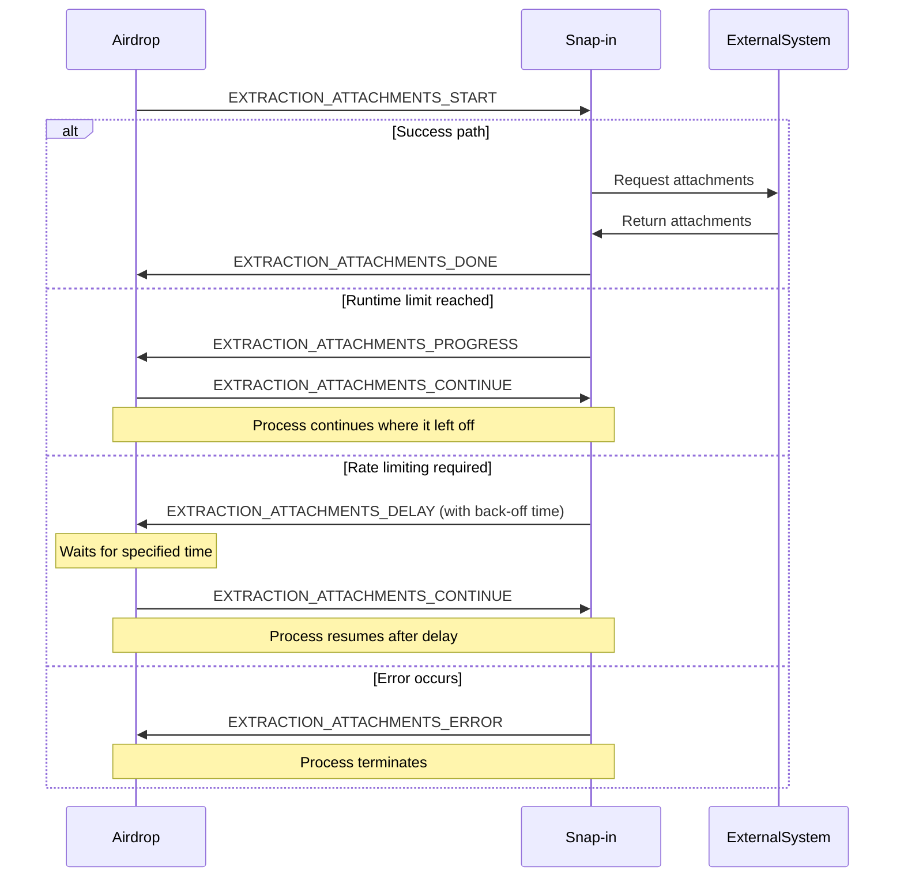

During the attachments extraction phase, the snap-in retrieves attachments from the external system and uploads them to DevRev. This phase occurs after data extraction, transformation, and loading are completed.

## Triggering event



### Event types

| Event | Direction | Description |
|-------|-----------|-------------|
| `EXTRACTION_ATTACHMENTS_START` | Airdrop → Snap-in | Initiates the attachments extraction |
| `EXTRACTION_ATTACHMENTS_PROGRESS` | Snap-in → Airdrop | Indicates process is ongoing but runtime limit (13 minutes) reached |
| `EXTRACTION_ATTACHMENTS_DELAY` | Snap-in → Airdrop | Requests a delay due to rate limiting from external system |
| `EXTRACTION_ATTACHMENTS_CONTINUE` | Airdrop → Snap-in | Resumes the extraction process after progress update or delay |
| `EXTRACTION_ATTACHMENTS_DONE` | Snap-in → Airdrop | Signals successful completion of attachments extraction |
| `EXTRACTION_ATTACHMENTS_ERROR` | Snap-in → Airdrop | Indicates that an error occurred during extraction |

## Implementation

### Default implementation

The SDK provides a default implementation for attachments extraction. If the default behavior (iterating through attachment metadata and uploading from saved URLs) meets your needs, **no additional implementation is required**.

### Custom implementation

If you need to customize the attachments extraction, modify the implementation in `attachments-extraction.ts`.
Use the `streamAttachments` function from the `WorkerAdapter` class, which handles most of functionality needed for this phase:

```typescript
const response = await adapter.streamAttachments({
  stream: getFileStream,
  batchSize: 10
});
```

Parameters:
- `stream`: (Required) Function that handles downloading attachments from the external system
- `batchSize`: (Optional) Number of attachments to process simultaneously (default: 1)

Increasing the batch size (from the default 1) can significantly improve performance. But be mindful of lambda memory constraints and external system rate limits when choosing batch size. A batch size between 10 and 50 typically provides good results.

```typescript Example 'stream' function
async function getFileStream({
  item,
}: ExternalSystemAttachmentStreamingParams): Promise<ExternalSystemAttachmentStreamingResponse> {
  const { id, url } = item;

  try {
    const fileStreamResponse = await axiosClient.get(url, {
      responseType: 'stream',
      headers: {
        'Accept-Encoding': 'identity',
      },
    });

    return { httpStream: fileStreamResponse };
  } catch (error) {
    if (axios.isAxiosError(error)) {
      console.warn(`Error while fetching attachment ${id} from URL.`, serializeAxiosError(error));
      console.warn('Failed attachment metadata', item);
    } else {
      console.warn(`Error while fetching attachment ${id} from URL.`, error);
      console.warn('Failed attachment metadata', item);
    }

    return {
      error: {
        message: `Failed to fetch attachment ${id} from URL.`,
      },
    };
  }
}
```

## Emitting responses

The snap-in must send exactly one response to Airdrop when extraction is complete:

```typescript Success response
await adapter.emit(ExtractorEventType.ExtractionAttachmentsDone);
```

```typescript Delay response (for rate limiting)
await adapter.emit(ExtractorEventType.ExtractionAttachmentsDelay, {
  delay: "30",  // Delay in seconds
});
```

```typescript Error response
await adapter.emit(ExtractorEventType.ExtractionAttachmentsError, {
  error: "Informative error message",
});
```

<Note>The snap-in must always emit exactly one response event.</Note>
