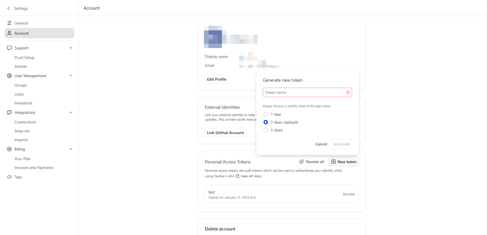

## Security token types

- **Application Access Token (AAT)**: Uniquely identifies an application belonging to a dev org. An AAT is obtained by a dev user with the right level of privileges for a given application. The AAT is issued against an application ID, which could represent the dev org's SaaS app. The AAT can only be used to obtain a session token; it does not reference any dev user or customer. At the time of the token generation, the corresponding dev user can define the expiration time of the token. The lifetime of an AAT is usually in days. The subject of the AAT is set to the DON of the application, which is service account (for example, `don:identity:dvrv-us-1:devo/0:svcacc/gG88A`).

- **System User Token (SUT)**: Uniquely identifies a system user belonging to a dev org. A SUT is obtained by a dev user with the right level of privileges for a given system user. The SUT is issued for the DON of the corresponding system user. At the time of the token generation, the corresponding dev user can define the expiration time of the token. The lifetime of a SUT is usually in days. The subject of the SUT is set to the DON of the corresponding system user (for example, `don:identity:dvrv-us-1:devo/0:sysu/1`).

- **Session Token**: Obtained by an application to access DevRev APIs on behalf of a customer (or customer). The application uses its own AAT to authenticate to the STS to obtain a session token for a customer and then uses that session token to access DevRev APIs. The lifetime of a session token is usually minutes. The subject of the session token is set to the DON of the corresponding customer (for example, `don:identity:dvrv-us-1:devo/0:revo/6:revu/131`).

- **Personal Access Token (PAT)**: Uniquely identifies a dev user. A PAT can be used by external applications to access DevRev APIs on behalf of the corresponding dev user. The lifetime of a PAT is usually in days. The subject of the PAT is set to the corresponding dev users DON (for example, `don:identity:dvrv-us-1:devo/0:devu/30`).

## Personal access token usage

Authentication to DevRev APIs requires a personal access token (PAT). A PAT is used to uniquely identify a dev user in context of a dev org and can be used by external third-party applications to access DevRev APIs on behalf of the corresponding dev user. A PAT has the same set of privileges that the owner of the PAT has on the DevRev platform.
You can set the validity duration of a PAT. You can't renew a PAT; you can only create a new PAT and update your code to use it.
For example, a VS Code plugin that pulls issues from the DevRev platform pertaining to a particular dev user needs to rely on that user’s PAT to authenticate the DevRev APIs.
If you are receiving an `invalid token` error, you can check whether the token is valid at [jwt.io](https://jwt.io/).

## Generate a personal access token (PAT)

1. In the DevRev app, go to the relevant dev org.
2. Go to **Settings** > **Account** > **Personal Access Token**.
3. Click **New token** and follow the workflow to create your PAT.

<Callout intent="warning">
As the token value isn't retrievable later, using descriptive names for PATs is recommended as it can help you differentiate between multiple PATs.
</Callout>

 

4. Copy the PAT and store it securely. Once you go to another page, you can't retrieve this PAT again.

## Revoke a personal access token

<Callout intent="error">
 Once a PAT is revoked, it can't be restored. Never share tokens with other users or applications. Do not publish tokens in public code repositories.
</Callout>

1. In the DevRev app, go to the relevant dev org.
1. Go to **Settings** > **Account** > **Personal Access Token**.
1. Click **Revoke** next to the PAT you wish to revoke.

You can also click the **Revoke all** to revoke all the tokens which you have previously generated.
