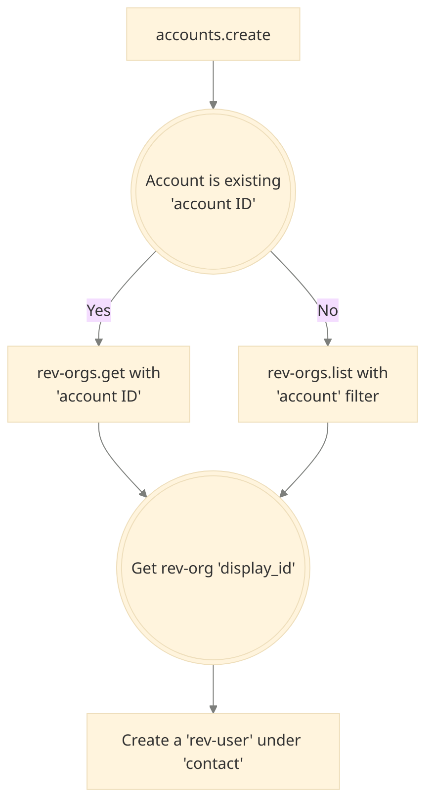
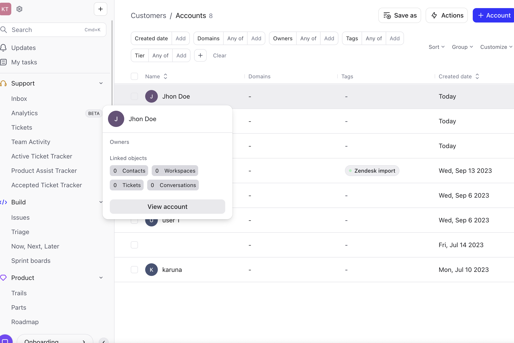
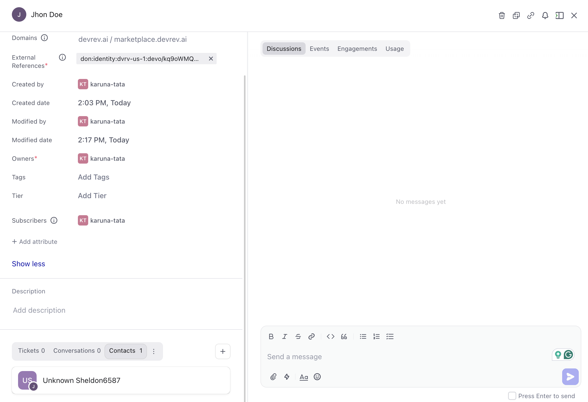

In this tutorial, you'll learn how to create an account and contacts associated with it in DevRev via `accounts-create` and `rev-users.create` API. You can also [create accounts manually in DevRev app](https://docs.devrev.ai/product/customers#add-new-customers).
The `accounts-create` API is used to create [accounts](https://docs.devrev.ai/product/grow#-account) which represents a customer organization and it holds information about the company, including its name, address, industry, domain, and website address.

The `rev-users.create` API is used to create [contacts](https://docs.devrev.ai/product/grow#-contact) which represents an individual user associated with the account of the organization. To create a contact, we also need to use the `rev-orgs.list` API with the `accounts` filter to get the default [workspace](https://docs.devrev.ai/product/grow#-workspace)(rev org) created with the account. We will be creating a contact under the workspace (`rev_org`) of the account as contacts (`rev_user`) cannot exist individually without being associated with a workspace.


<Callout intent="tip">
Just want to get a token and get started? This [tutorial](/about/authentication#generate-a-personal-access-token-pat) teaches you the fastest way to get a token.
</Callout>



## Create an account

The payload to make a request is given below:

```json
{
  "display_name": "<account name>"
}
```

`display_name` must be of type string and can be any name you want to create the account with.

1. Make a POST request to "https://api.devrev.ai/accounts.create" and include the PAT created in the authorization header of the request along with the payload with replaced IDs.

   In this example, you are using curl to make the requests but can use any tool you prefer.

   ```bash
   curl --location 'https://api.devrev.ai/accounts.create' \
    --header 'Content-Type: application/json' \
    --header 'Accept: application/json' \
    --header 'Authorization: <PAT>' \
    --data '{
        "display_name": "John Doe"
        }'
   ```

   You receive the following response.

   ```JSON focus={49} maxLines=10
   {
       "account": {
           "created_by": {
               "type": "dev_user",
               "display_id": "DEVU-1",
               "display_name": "some org",
               "email": "someorg@someorg.com",
               "full_name": "some org",
               "id": "don:identity:dvrv-us-1:devo/<devo-id>:devu/<devu-id>",
               "state": "active"
           },
           "created_date": "2024-03-07T08:33:18.605Z",
           "display_id": "ACC-<acc-id>",
           "display_name": "John Doe",
           "external_refs": [
               "don:identity:dvrv-us-1:devo/<devo-id>:account/<acc-id>"
           ],
           "id": "don:identity:dvrv-us-1:devo/<devo-id>:account/<acc-id>",
           "modified_by": {
               "type": "dev_user",
               "display_id": "DEVU-1",
               "display_name": "someorg",
               "email": "someorg@someorg.com",
               "full_name": "some org",
               "id": "don:identity:dvrv-us-1:devo/<devo-id>:devu//<devu-id>",
               "state": "active"
           },
           "modified_date": "2024-03-07T08:33:18.605Z",
           "owned_by": []
       },
       "default_rev_org": {
           "account": {
               "display_id": "ACC-<acc-id>",
               "display_name": "John Doe",
               "id": "don:identity:dvrv-us-1:devo/<devo-id>:account/<acc-id>"
           },
           "created_by": {
               "type": "dev_user",
               "display_id": "DEVU-1",
               "display_name": "someorg",
               "email": "someorg@someorg.com",
               "full_name": "some org",
               "id": "don:identity:dvrv-us-1:devo/<devo-id>:devu//<devu-id>",
               "state": "active"
           },
           "created_date": "2024-03-07T08:33:18.608Z",
           "display_id": "REV-<revo-id>",
           "display_name": "John Doe",
           "external_ref": "don:identity:dvrv-us-1:devo/<devo-id>:account/<acc-id>",
           "id": "don:identity:dvrv-us-1:devo/<devo-id>:revo/<revo-id>",
           "modified_by": {
               "type": "dev_user",
               "display_id": "DEVU-1",
               "display_name": "someorg",
               "email": "someorg@someorg.com",
               "full_name": "some org",
               "id": "don:identity:dvrv-us-1:devo/<devo-id>:devu/<devu-id>",
               "state": "active"
           },
           "modified_date": "2024-03-07T08:33:18.608Z",
           "stock_schema_fragment": "don:core:dvrv-us-1:stock_sf/32027"
       }
   }
   ```

The response contains `"external_ref": "don:identity:dvrv-us-1:devo/<devo-id>:account/<acc-id>",`. The `external_ref` identifies the `devo` ID (Dev organization ID) as `devo/<devo-id>` and the `account` ID as `account/<acc-id>`. 

1. Check **Customers > Accounts** in the DevRev app to confirm that that account was created.

   

## Create a contact

To create a contact associated with the account you created, follow the steps listed below:

Get the default rev org created along with the newly created account using the `rev-orgs.list` API:

    1. Make a GET/POST request to "https://api.devrev.ai/rev-orgs.list" using cURL with the `account` filter. Use the `external_ref` from the previous response as an `account` filter.
    
       ```bash
        curl -X POST https://api.devrev.ai/rev-orgs.list \
            -H "Authorization: <apiKey>" \
            -H "Content-Type: application/json" \
            -d '{"account": [
                    "<external reference of the account>"
                ]
            }'
       ```
    
       It returns the following response:
    
       ```json focus={19}
       {
         "rev_orgs": [
           {
             "account": {
               "display_id": "ACC-id",
               "display_name": "John Doe",
               "id": "don:identity:dvrv-us-1:devo/<devo-id>:account/<acc-id>"
             },
             "created_by": {
               "type": "dev_user",
               "display_id": "DEVU-1",
               "display_name": "someorg",
               "email": "someorg@someorg.com",
               "full_name": "some org",
               "id": "don:identity:dvrv-us-1:devo/<devo-id>:devu//<devu-id>",
               "state": "active"
             },
             "created_date": "2024-03-07T08:33:18.608Z",
             "display_id": "REV-<revo-id>",
             "display_name": "John Doe",
             "external_ref": "don:identity:dvrv-us-1:devo/<devo-id>:account/<acc-id>",
             "id": "don:identity:dvrv-us-1:devo/<devo-id>:revo/<revo-id>",
             "modified_by": {
               "type": "sys_user",
               "display_id": "SYSU-1",
               "display_name": "devrev-bot",
               "full_name": "DevRev Bot",
               "id": "don:identity:dvrv-us-1:devo/<devo-id>:sysu/1",
               "state": "active"
             },
             "modified_date": "2024-03-07T08:47:04.346Z",
             "stock_schema_fragment": "don:core:dvrv-us-1:stock_sf/32027"
           }
         ]
       }
       ```
    
       Note the `display_id` (example: `REV-abcd`) of the rev org from the response.

- If there is an existing account then you can get the default rev org using the `rev-orgs.get` API:

    - Make a GET request to "https://api.devrev.ai/rev-orgs.get" using cURL with the `account` filter.
    
       ```bash
          curl -G https://api.devrev.ai/rev-orgs.get \
               -H "Authorization: <apiKey>" \
               -d account=ACC-12345 \
       ```
    
2. Make a POST request to "https://api.devrev.ai/rev-users.create" to create a rev-user.

   In the request, set `rev_org` to the value of the `display_id` from the previous reponse.

   ```bash
    curl -X POST https://api.devrev.ai/rev-users.create \
        -H "Authorization: <apiKey>" \
        -H "Content-Type: application/json" \
        -d '{
            "rev_org": "<rev org display-id>"
        }'
   ```

   You receive the following response:

   ```json
   {
     "rev_user": {
       "created_by": {
         "type": "dev_user",
         "display_id": "DEVU-1",
         "display_name": "someorg",
         "email": "someorg@someorg.com",
         "full_name": "some org",
         "id": "don:identity:dvrv-us-1:devo/<devo-id>:devu//<devu-id>",
         "state": "active"
       },
       "created_date": "2024-03-07T09:54:08.908Z",
       "display_id": "REVU-<revu-id>",
       "display_name": "Unknown Sheldon6587",
       "external_ref": "REVU-<revu-id>",
       "id": "don:identity:dvrv-us-1:devo/<devo-id>:revu/<revu-id>",
       "is_verified": true,
       "modified_by": {
         "type": "dev_user",
         "display_id": "DEVU-1",
         "display_name": "someorg",
         "email": "someorg@someorg.com",
         "full_name": "some org",
         "id": "don:identity:dvrv-us-1:devo/<devo-id>:devu//<devu-id>",
         "state": "active"
       },
       "modified_date": "2024-03-07T09:54:08.908Z",
       "rev_org": {
         "type": "rev_org",
         "display_id": "REV-<revo-id>",
         "display_name": "John Doe",
         "id": "don:identity:dvrv-us-1:devo/<devo-id>:revo/<revo-id>"
       },
       "state": "active",
       "stock_schema_fragment": "don:core:dvrv-us-1:stock_sf/32026"
     }
   }
   ```

You have now successfully created a contact for the account. You can check the contacts created on the DevRev app by going to **Customers** > **Contacts** or by clicking the account you created in **Accounts** and selecting the **Contacts** tab to view all the contacts created for the selected account.


