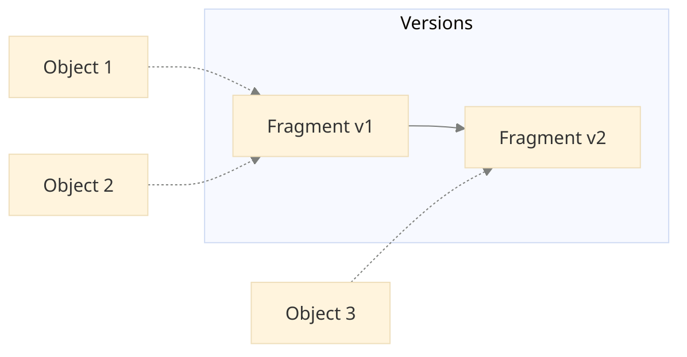
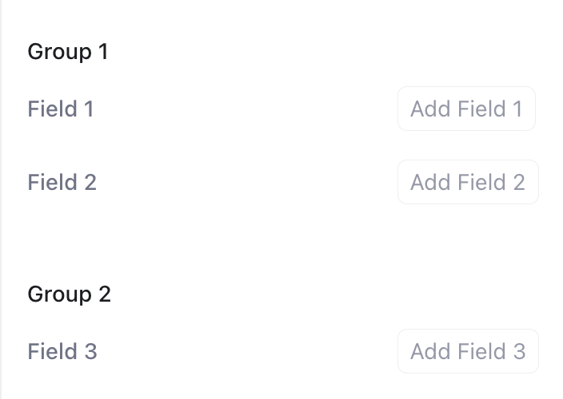
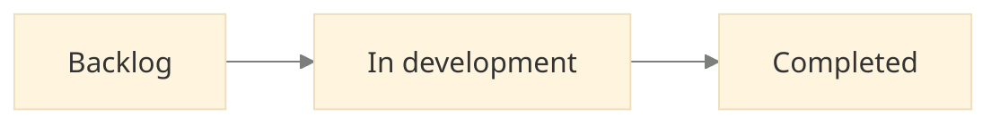
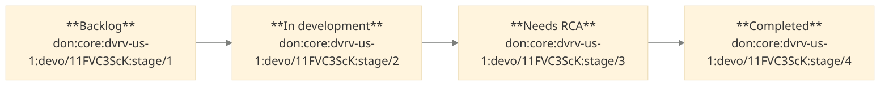

DevRev allows you to customize its core objects such as _issue_ and _ticket_ to fit
your organization's unique workflows and reporting needs. By using the customization
framework, you can extend these objects with custom fields that reflect your processes.

This section provides an overview of the customization framework and walks you through the
process of tracking bugs in your organization. By the end of this section, you'll be able
to:
1. Customize DevRev objects such as _issue_ and _ticket_ by adding custom fields.
1. Override default field settings of DevRev objects.
1. Create custom stages and stage transition diagrams for your objects.
1. Create dependent fields for your objects.

## Concepts

### DevRev object

DevRev objects are the core entities that represent real-world items such as issues,
tickets, and incidents. Each object type has a set of fields that describe the object.

<Callout intent="tip">
When you encounter `leaf_type` in the documentation or API, it refers to the type of DevRev
object you're working with, such as an _issue_ or _ticket_.
</Callout>

### Schema fragment

DevRev objects are customized using _schema fragments_. A fragment is a building block
that defines a specific set of custom fields. When creating or updating an object
record, multiple schema fragments can be combined to determine the full set of custom
fields available for that record. The term _fragment_ is used because each schema
fragment contributes a portion of the overall object schema.

### Tenant custom field

Tenant custom fields allow extending the DevRev objects by adding new fields. These
custom fields are applied to all records of the specified object type within the
organization. For example, a release notes tenant custom field for _issue_ is applicable
to all _issue_ records in the organization.

Tenant custom fields are defined in a schema fragment of type `tenant_fragment`.

### Subtype

Subtypes are kinds of DevRev object types. They inherit all fields from the parent type
and can include additional specific fields. For example, a _bug_ subtype of
_issue_ would have all _issue_ fields plus _bug_-specific fields like _RCA_.

Subtypes are defined using a schema fragment of type `custom_type_fragment`.

## Customizing a DevRev object
<Callout intent="note">
Your team needs to track software bugs. You want to know:
- Which environments are affected (development, testing, production)
- Whether it's a regression (a bug in previously working code)
- The root cause analysis (RCA) of the bug
</Callout>

First, create a schema fragment defining the fields for the _bug_ subtype.
Make sure to replace `<TOKEN>` with your API token.

```curl
curl --location 'https://api.devrev.ai/schemas.custom.set' \
--header 'Content-Type: application/json' \
--header 'Authorization: <TOKEN>' \
--data '{
    "type": "custom_type_fragment",
    "description": "Attributes for tracking a bug",
    "leaf_type": "issue",
    "subtype": "bug",
    "subtype_display_name": "Bug",
    "fields": [
        {
            "name": "impacted_environments",
            "field_type": "array",
            "base_type": "enum",
            "allowed_values": [ "Dev", "QA", "Prod" ],
            "is_filterable": true,
            "ui": {
                "display_name": "Impacted Environments",
            }
        },
        {
            "name": "regression",
            "field_type": "bool",
            "ui": {
                "display_name": "Regression",
            }
        },
        {
            "name": "rca",
            "field_type": "rich_text",
            "ui": {
                "display_name": "RCA",
            }
        },
    ]
}'
```

<Callout intent="note">
A bug has been identified in the production environment. The reporter creates a
_bug_-flavored _issue_ object to track it and assigns a relevant owner.
</Callout>

```curl {11-17}
curl --location 'https://api.devrev.ai/works.create' \
--header 'Content-Type: application/json' \
--header 'Authorization: <TOKEN>' \
--data '{
    "type": "issue",
    "title": "API failure in Prod",
    "owned_by": "<OWNER_ID>",

    ... // other required fields

    "custom_schema_spec": {
        "subtype": "bug"
    },
    "custom_fields": {
        "ctype__impacted_environments": [ "QA", "Prod" ]
        "ctype__regression": true,
    }
}'
```

After resolving the bug, the developer can update the issue object with release
notes. Adding release notes provides a clear record of what was deployed to resolve the
bug which can be valuable for future reference and communication with stakeholders.

To add release notes for the completed work, you can create a tenant custom field for
the _issue_.

<Callout intent="tip">
Since release notes are relevant to all issues, a tenant custom field is used instead of
a subtype-specific field.
</Callout>

```curl
curl --location 'https://api.devrev.ai/schemas.custom.set' \
--header 'Content-Type: application/json' \
--header 'Authorization: <TOKEN>' \
--data '{
    "type": "tenant_fragment",
    "description": "Tenant attributes for issues",
    "leaf_type": "issue",
    "fields": [
        {
            "name": "release_notes",
            "field_type": "rich_text",
            "ui": {
                "display_name": "Release Notes",
            }
        }
    ]
}'
```

Populate the release notes in the issue object created above:

```curl {8-13}
curl --location 'https://api.devrev.ai/works.update' \
--header 'Content-Type: application/json' \
--header 'Authorization: <TOKEN>' \
--data '{
    "id": "don:core:dvrv-us-1:devo/test:issue/1",
    "type": "issue",
    "custom_schema_spec": {
        "tenant_fragment": true
    },
    "custom_fields": {
        "tnt__release_notes": "<RELEASE_NOTES>"
    }
}'
```

The final issue object now looks as follows:
```json {10-19}
{
    "id": "don:core:dvrv-us-1:devo/test:issue/1",
    "type": "issue",
    "title": "API failure in Prod",
    "display_id": "ISS-1",
    "created_by": {...},
    "created_date": "2024-10-11T06:48:57.759Z",
    "modified_date": "2024-10-11T06:55:29.183Z",
    "stage": "resolved",
    "custom_fields": {
        "ctype__regression": true,
        "ctype__impacted_environments": [ "Prod" ],
        "tnt__release_notes": "<RELEASE_NOTES>"
    },
    "subtype": "bug",
    "custom_schema_fragments": [
        "don:core:dvrv-us-1:devo/test:custom_type_fragment/1"
        "don:core:dvrv-us-1:devo/test:tenant_fragment/1",
    ]
}
```

The following observations can be made from the above example:
* The custom fields defined by different fragments are held in different namespaces in an object.
  - Subtype fields are of the form `ctype__<field_name>`.
  - Tenant fields are of the form `tnt__<field_name>`.
* References to each fragment are stored with the object.
* When updating an object, the `custom_schema_spec` can specify only the fragments being
  modified. Here, only the tenant fragment is specified as only the release notes field
  is being updated.

## Supported custom field types

The following custom field types are supported -

| Type      | Example                                  |
| --------- | ---------------------------------------- |
| int       | `42`                                     |
| double    | `3.14`                                   |
| bool      | `true`                                   |
| tokens    | `"apple"`                                |
| text      | `"Hello, world!"`                        |
| rich_text | `"**Hello**, world!"`                    |
| enum      | `"apple"`                                |
| timestamp | `"2020-10-20T00:00:00Z"` (RFC3339)       |
| date      | `"2020-10-20"` (YYYY-MM-DD)              |
| id        | `"don:core:dvrv-us-1:devo/test:issue/1"` |

The list variants of all the supported custom field types are also supported.
In the example above, the `impacted_environments` field is a list of enum values.

## Filtering DevRev objects

<Callout intent="note">
To demonstrate filtering capabilities, consider finding all bugs in the production
environment that had a customer impact.
</Callout>

This translates to filtering _issue_ objects with subtype _bug_, _customer_impact_ set
to `true` and _impacted_environments_ containing `"Prod"`.

```curl
curl --location 'https://api.devrev.ai/works.list' \
--header 'Content-Type: application/json' \
--header 'Authorization: <TOKEN>' \
--data '{
    "type": [ "issue" ],
    "issue": {
        "subtype": [ "bug" ]
    },
    "custom_fields": {
        "ctype__customer_impact": [ true ],
        "ctype__impacted_environments": [ "Prod" ]
    }
}'
```

Note that both _customer_impact_ and _impacted_environments_ are filterable fields,
marked with `is_filterable: true` above.

## Schema fragment versioning

Schema fragments are immutable. When evolving a fragment:
1. A new fragment is created and chained to the older one.
2. The older fragment remains intact.
3. Objects referencing the older fragment are unaffected (more on this later).

The same API endpoint `schemas.custom.set` is used to create and update fragments. The
API internally figures out how to version and chain the fragments.

<Callout intent="note">
You want to add a new boolean field _customer_impact_ to the _bug_ subtype
and delete the _regression_ field.
</Callout>

 The API call to add the new field and delete the old field is shown below:

```curl {28-36}
curl --location 'https://api.devrev.ai/schemas.custom.set' \
--header 'Content-Type: application/json' \
--header 'Authorization: <TOKEN>' \
--data '{
    "type": "custom_type_fragment",
    "description": "Attributes for tracking a bug",
    "leaf_type": "issue",
    "subtype": "bug",
    "fields": [
        {
            "name": "impacted_environments",
            "field_type": "array",
            "base_type": "enum",
            "allowed_values": [ "Dev", "QA", "Prod" ],
            "is_filterable": true,
            "ui": {
                "display_name": "Impacted Environments",
            }
        },
        {
            "name": "rca",
            "field_type": "rich_text",
            "ui": {
                "display_name": "RCA",
            }
        },
        {
            "name": "customer_impact",
            "field_type": "bool",
            "is_filterable": true,
            "ui": {
                "display_name": "Customer Impact",
            }
        }
    ],
    "deleted_fields": [ "regression" ]
}'
```

Note that:
* The API payload reflects the entire state of the new fragment version.
* The `deleted_fields` array specifies the field names that are being deleted. If not
  provided, the API call fails due to the lack of an explicit field deletion
  confirmation. This prevents accidental field deletions.

The above API call internally performs the following steps:
1. Creates a new fragment with the specified payload.
1. Updates the new fragment to point to the previous fragment. The `old_fragment_ref`
system field in the new fragment points to the previous fragment.
1. Updates the old fragment to point to the new fragment. The `new_fragment_ref` system
field in the old fragment points to the new fragment.

The diagram below shows the relationship between the fragments and how the versioning
scheme preserves the referential integrity.



### Object upgrades

A natural question arises at this point: what happens to the objects referencing the
old fragment version?

The object get and list APIs automatically upgrade the object **in-memory** to the
latest fragment version when queried. The necessary field adjustments are done in this
process. In the example above, when the object referencing the old fragment is read, the
_regression_ field is dropped in the response.

```curl {16-18, 21}
curl --location 'https://api.devrev.ai/works.get' \
--header 'Content-Type: application/json' \
--header 'Authorization: <TOKEN>' \
--data '{
    "id": "don:core:dvrv-us-1:devo/test:issue/2"
}'

{
    "work": {
        "id": "don:core:dvrv-us-1:devo/test:issue/2",
        "type": "issue",
        "title": "Critical Service Outage",
        "display_id": "ISS-x",
        "created_by": {...},
        "created_date": "2024-10-12T08:30:15.123Z",
        "custom_fields": {
            "ctype__impacted_environments": [ "Prod" ]
        },
        "subtype": "bug",
        "custom_schema_fragments": [
            "don:core:dvrv-us-1:devo/test:custom_type_fragment/2"
            "don:core:dvrv-us-1:devo/test:tenant_fragment/1",
        ]
    }
}
```

The object now references the latest fragment version (`custom_type_fragment/2`). While
the optional release notes field is absent, the tenant fragment remains attached,
allowing for future tenant-specific field additions.

## Deprecating a custom schema fragment

Custom schema fragments can be deprecated to avoid creating work items using them. The
following POST request payload to `schemas.custom.set` can be used:

```json {9}
{
    "type": "custom_type_fragment",
    "description": "Attributes for tracking a bug",
    "leaf_type": "issue",
    "subtype": "bug",
    "fields": [
        ...
    ],
    "deprecated": true,
}
```

## Listing custom schema fragments

The following API call can be used to list all the custom schema fragments in your
organization:

```curl
curl --location 'https://api.devrev.ai/schemas.custom.list' \
--header 'Content-Type: application/json' \
--header 'Authorization: <TOKEN>'
```

Deprecated fragments aren't listed in the response.

## UI hints

UI hints allow customizing the UI/UX of custom fields. So far, `ui.display_name` has
been used to set the display name of a field. Let's look at the other supported UI
hints:

* `display_name`: The display name of the field.
* `is_hidden`: Whether the field is hidden.
* `placeholder`: The placeholder text for the field.
* `is_sortable`: Whether the field is sortable. Requires `is_filterable` to be true.
* `is_groupable`: Whether the field is groupable. Requires `is_filterable` to be true.
* `order`: The order in which the field appears in the side panel.
* `group_name`: The group title under which field(s) appear in the side panel. In the
  example below, the fields are grouped under groups titled **Group 1** and **Group 2**.

  

<Callout intent="tip">
`is_filterable` is not a UI hint but a top level field property.
</Callout>

## Stock field overrides

The fields available in native DevRev objects are called stock fields. For example,
`priority` is a stock field of _issue_.

<Callout intent="note">
You want to do the following modifications to the priority field in your organization:

1. Update the UI display name from _Priority_ to _Urgency Level_.
1. Update the allowed values from _P0_, _P1_, _P2_, and _P3_ to _Low_, _Medium_, _High_, and _Blocker_.
</Callout>

Since the modification is applicable to all issues, you can create a tenant schema
fragment with the following payload:

```curl
curl --location 'https://api.devrev.ai/internal/schemas.custom.set' \
--header 'Content-Type: application/json' \
--header 'Authorization: <TOKEN>' \
--data '{
  "type": "tenant_fragment",
  "leaf_type": "issue",
  "description": "Stock field overrides demo",
  "fields": [],
  "stock_field_overrides": [
    {
      "name": "priority_v2",
      "uenum_values": [
        {
          "id": 1,
          "label": "Blocker",
          "ordinal": 1
        },
        {
          "id": 2,
          "label": "High",
          "ordinal": 2
        },
        {
          "id": 3,
          "label": "Medium",
          "ordinal": 3
        },
        {
          "id": 4,
          "label": "Low",
          "ordinal": 4
        }
      ],
      "ui": {
        "display_name": "Urgency Level",
      }
    }
  ]
}'
```

A few observations can be made from the above payload:
* The `stock_field_overrides` array contains the overrides for the stock fields.
* The `name` field in the override specifies the stock field to be overridden.
* The `uenum_values` array contains the new allowed values for the stock field.
* Each allowed value in the `uenum_values` array must have a unique `id`. Since labels can change, the `id` is used to identify the value.
* The `ordinal` field is used to determine the sort order of the values.
* The `ui.display_name` field updates the display name of the stock field.

If you want the overrides to be scoped to a subtype, you can add them to the subtype
instead.

## Stage customization

Stages represent the different phases an object can be in during its lifecycle. For
example, an issue might go through the following lifecycle:



Customizing the stages allows you to tailor the object lifecycle to your organization's
specific requirements.

A state is a group of stages. For example, the _open_ state groups the _triage_,
_backlog_, and _prioritized_ stages. By default, DevRev creates _open_, _in_progress_,
and _closed_ states in your organization.

<Callout intent="note">
You want to add a new stage _Needs RCA_ to the _bug_ subtype.
</Callout>

### Adding a custom stage

```curl
curl --location 'https://api.devrev.ai/stages.custom.create' \
--header 'Content-Type: application/json' \
--header 'Authorization: <TOKEN>' \
--data '{
    "name": "Needs RCA",
    "state": "closed",
    "ordinal": 1000
}'
```

A stage can be referenced by any object type. For example, both _issue_ and _ticket_
object types can use the _in_development_ stage. It's incorrect to say that the stage is
bound to an _issue_ or _ticket_.

### Stage diagram

A stage diagram determines the allowed transitions between stages for a given object.
For example, _triage_ stage can transition to _backlog_ stage but not vice versa.

Let's create a stage diagram for the _bug_ subtype:



```curl {11}
curl --location 'https://api.devrev.ai/stage-diagrams.create' \
--header 'Content-Type: application/json' \
--header 'Authorization: <TOKEN>' \
--data '{
    "leaf_type": "issue",
    "subtype": "bug",
    "stages": [
        {
            "stage_id": "don:core:dvrv-us-1:devo/test:stage/1",
            "is_start": true,
            "transitions": [
                {
                    "target_stage_id": "don:core:dvrv-us-1:devo/test:stage/2",
                }
            ]
        },
        {
            "stage_id": "don:core:dvrv-us-1:devo/test:stage/2",
            "transitions": [
                {
                    "target_stage_id": "don:core:dvrv-us-1:devo/test:stage/3"
                }
            ]
        },
        {
            "stage_id": "don:core:dvrv-us-1:devo/test:stage/3",
            "transitions": [
                {
                    "target_stage_id": "don:core:dvrv-us-1:devo/test:stage/4"
                }
            ]
        },
        {
            "stage_id": "don:core:dvrv-us-1:devo/test:stage/4",
        }
    ]
}'
```

<Callout intent="tip">
It is important to specify the start stage for the diagram. This is the default stage that gets assigned to the newly created objects.
</Callout>

### Using a stage diagram

The stage diagram created above can be referenced in the _bug_ subtype as follows:

```curl {9}
curl --location 'https://api.devrev.ai/schemas.custom.set' \
--header 'Content-Type: application/json' \
--header 'Authorization: <TOKEN>' \
--data '{
    "type": "custom_type_fragment",
    "leaf_type": "issue",
    "subtype": "bug",
    "stage_diagram_id": "don:core:dvrv-us-1:devo/test:stages_diagram/1",
    "fields": [
        ... // no changes
    ]
}'
```

All objects of the _bug_ subtype now adhere to the stage diagram created above.

## Dependent fields

<Callout intent="note">
The developers in your organization tend to forget to add an RCA when resolving the
bugs. You can make the _RCA_ field required when a _bug_ object is moved to the
_completed_ stage by adding a dependent field constraint.
</Callout>

```curl {12-22}
curl --location 'https://api.devrev.ai/schemas.custom.set' \
--header 'Content-Type: application/json' \
--header 'Authorization: <TOKEN>' \
--data '{
    "type": "custom_type_fragment",
    "leaf_type": "issue",
    "subtype": "bug",
    "fields": [
        ... // no changes
    ],
    "conditions": [
        {
            "expression": "stage == 'don:core:dvrv-us-1:devo/test:stage/5'",
            "effects": [
                {
                    "fields": [ "custom_fields.rca" ],
                    "require": true
                }
            ]
        }
    ]
}'
```

Any attempt to update a _bug_ object to the _completed_ stage without populating
the _RCA_ field is rejected.

The supported operators are `==`, `!=`, `>`, `>=`, `<`, `<=`. The `expression` is a
boolean expression that must return a boolean value.

The `effects` array contains the list of effects of the condition. The following effects are supported:
* `require`: Whether the field must be set for the condition to be met.
* `show`: Whether the field must be shown for the condition to be met.
* `allowed_values`: The conditional allowed values for the enum type field.

<Callout intent="tip">
`don:core:dvrv-us-1:devo/test:stage/5` is the ID of the _completed_ stage. The
stage display name is not used in the expression because it is liable to change.
</Callout>

Constraints on stock fields can only be strengthened.
For example, a required stock field cannot be made optional, and a hidden stock
field cannot be made visible.
