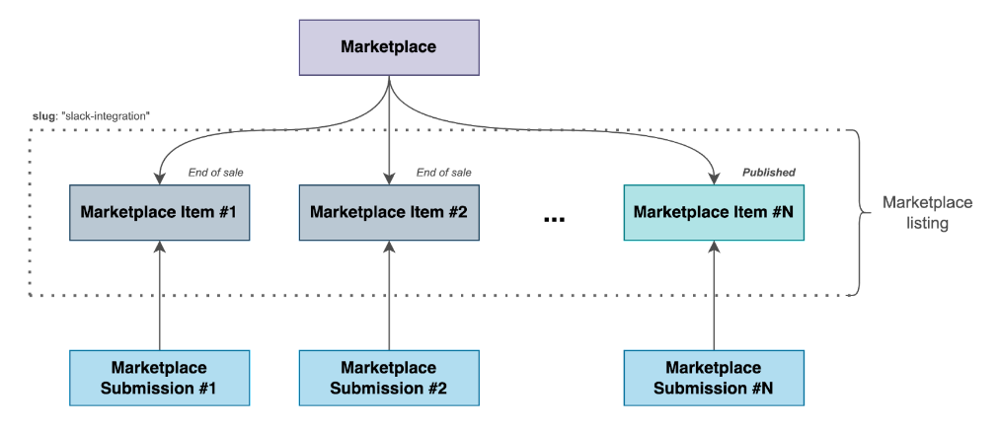
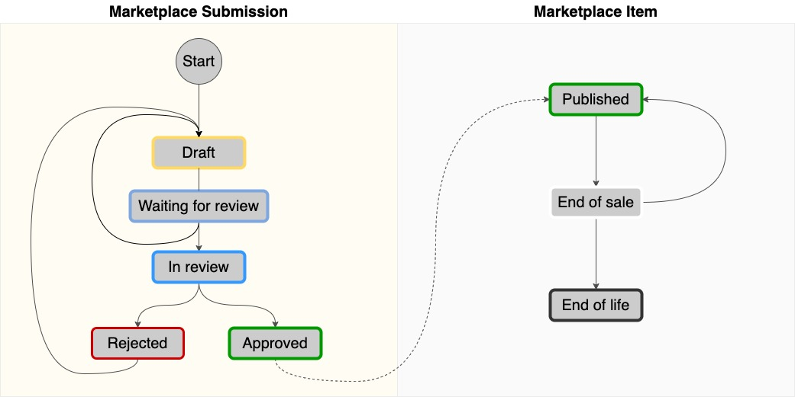
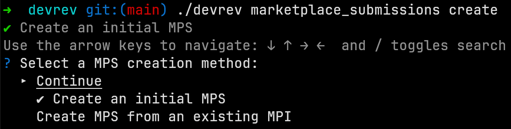
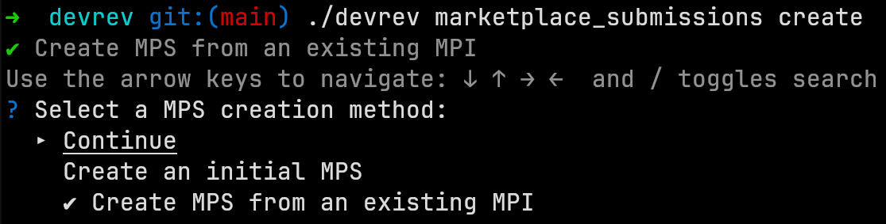

# Publish a listing to the Marketplace

This guide walks you through the process of submitting your marketplace listing, reviewing it, and publishing it for users to access and engage with. You learn about creating and updating marketplace submissions, the roles of the marketplace publisher and admin, and the steps involved in getting your submission approved. Whether you're new to the DevRev CLI or looking for a refresher, this documentation provides you with the necessary information to go through the publishing process seamlessly. Let's dive in and get started.

## Glossary

### Marketplace

A platform for creators and consumers to collaborate, engage, and conduct transactions. It provides an avenue for distributing your products and services, thereby enabling you to generate revenue from them.

### Marketplace submission

An object used as a proposal for a marketplace listing which marketplace admins can review and approve/reject.

### Marketplace item

Any item in marketplace listings that is available for installation.

### Marketplace listing

All marketplace items that have the same slug. It is also important to note that at most one item, belonging to a specific marketplace listing, can be in the _Published_ state.



## Publishing process

The marketplace publisher creates a marketplace submission, requesting the creation of a new marketplace listing or updating an existing one. Once the submission is ready for review, the publisher transitions it to the _Waiting for review_ state. During this phase, an admin reviews and decides whether to approve or reject the submission. If the admin approves the submission, the publisher can proceed to publish it. However, if the admin rejects the submission, the publisher can update and resubmit it for another round of review.



## Before you begin

To get started with creation of marketplace listings, you need to have the DevRev CLI installed. You can find the [installation guide here](https://developer.devrev.ai/snapin-development/references/cli-install). You also need a snap-in for which the listing will be created. If you haven't created a snap-in yet and need help, [click here](https://developer.devrev.ai/snapin-development/tutorials/overview).

## Manage marketplace listings

1. ### Create marketplace listing

    #### Initial submission

    When creating a new marketplace listing, an initial marketplace submission must be created with all the mandatory properties. To create a new listing, run the following command, which will start a wizard to guide you through the process:

    ```bash
    devrev marketplace_submissions create
    ```

    

    #### New submission for an existing marketplace item

    When a marketplace listing already exists (there is at least one marketplace item in the _Published_ or _End of sale_ state), you can modify it by creating a new marketplace submission.

    To create a new submission for an existing listing, run the following command, which will start a wizard to guide you through the process:

    ```bash
    devrev marketplace_submissions create
    ```

    

2. ### Update marketplace submission

    Once a marketplace submission has been created, it can be updated by running the following command, which will start a wizard to guide you through the process:

    ```bash
    devrev marketplace_submissions update
    ```

3. ### Publish marketplace submission

    The newly created marketplace submission is in the _Draft_ state. In order to publish it, we first have to transition it to _Waiting for review_ state. This can be done by running the following command, which will start a wizard to guide you through the process:

    ```bash
    devrev marketplace_submissions transition
    ```

    Once the submission is transitioned to the _Waiting for review_ state, it needs to be approved by a marketplace admin. While in review, the state of the submission is _In review_. Once it is reviewed, the state will be changed to either _Approved_ or _Rejected_.

    <Callout intent="note">
    Submissions whose state is _In review_ or _Approved_ cannot be modified.
    </Callout>

    If the submission was rejected, you can transition it back to _Draft_ and modify it to satisfy the requirements. Once it is updated, you can transition it back to _Waiting for review_ to be reviewed again.

    If the submission was approved, you can publish it using the following command, which will start a wizard to guide you through the process:

    ```bash
    devrev marketplace_items publish
    ```

    To make sure that marketplace item was published you can retrieve it using its ID:

    ```bash
    devrev marketplace_items show [marketplace_item_id] | jq '{name: .name, id: .id}'
    ```

    Example:

    ```bash
    devrev marketplace_items show 'don:integration:dvrv-us-1:devo/1:marketplace/1:marketplace_item/1' | jq '{name: .name, id: .id}'
    ```

4. ### Delete marketplace submission

    If a marketplace submission was created by mistake or is no longer relevant, it can be deleted. However, deletion of a submission is only permitted for the owners of the submission and is restricted to submissions that are in the _Draft_ or _Rejected_ state.

    You can delete a submission using the following command, which will start a wizard to guide you through the process:

    ```bash
    devrev marketplace_submissions delete
    ```

## Automatic upgrade of marketplace listings installations

Automatic upgrade is supported for marketplace listings installations. Once a new version of the listing is published, the respective snap-in will be automatically upgraded to the latest version.

However, there are some criteria that need to be met for automatic upgrade to work:

- The upgrade should not require any user input/action.
- There should not be any new global variables added.
- There should not be any new connections that needs to be configured.

## Sharing marketplace listings

By default, all marketplace listings are accessible to all users. However, if you want to share a specific listing with certain organizations only, follow the steps below:

1. When creating an initial submission, property `access_level` should be set to `restricted`.
2. Proceed through the review process to obtain approval for the submission.
3. Once the submission is approved, publish it to create a marketplace item.
4. To invite a specific dev organization to the newly created item, execute the following command:

    ```bash
    devrev marketplace_items invite [marketplace_item_id] [dev_org_id]
    ```

    Example:

    ```bash
    devrev marketplace_items invite 'don:integration:dvrv-us-1:devo/1:marketplace/1:marketplace_item/1' 'don:identity:dvrv-us-1:devo/2'
    ```

Once an organization is invited to a listing, its members can view and install it within their own organization.

<Callout intent="note">
When a listing is marked as restricted, it is possible to change the access level to `public`. However, the reverse process, changing the access level from `public` to `restricted`, is not permitted.
</Callout>

When a listing is shared with an organization, this information is retained when creating new submissions for the same listing. Additionally, automatic upgrades function seamlessly, just like in the case of public listings.

## Command reference

Show a marketplace submission:

```bash
devrev marketplace_submissions show [marketplace_submission_id] | jq "{name: .name, id: .id, type: .type}"
```

List marketplace submissions:

```bash
devrev marketplace_submissions list | jq "{name: .name, id: .id, type: .type}"
```

Show a marketplace item:

```bash
devrev marketplace_items show [marketplace_item_id] | jq "{name: .name, id: .id, type: .type}"
```

List marketplace items:

```bash
devrev marketplace_items list | jq "{name: .name, id: .id, type: .type}"
```
