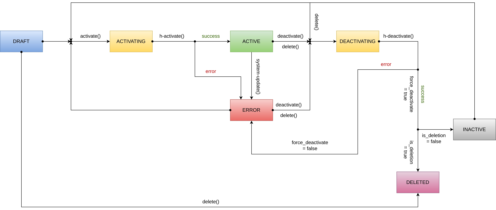

Hooks enable developers to invoke functions when various events in the lifecycle of a snap-in occur. They can be used to validate inputs and keyrings, as well as to register, update, and deregister resources on external systems.
Hooks can be used to catch errors early in the deployment cycle of a snap-in and enable semantic validation.

In order to define hooks, you can add the following section to your manifest:

```yaml
hooks:
  - type: validate
    function: validate-inputs

  - type: activate
    function: register-resource

  - type: deactivate
    function: deregister-resource

  - type: update
    function: update-resource
```

The above definition would register the hooks and invoke the provided functions alongside each hook. The functions can be defined in the manifest and provided in the code as explained in the [functions reference](/snapin-development/references/functions).

For the event schema received by the function invocation, refer to the [function invocation reference](/snapin-development/references/function-invocation).

The event name is the identifier for the hook. The event name can be used to identify the hook that's being invoked. The identifiers are defined in the summary table below.

The following hooks are available: validate, activate, deactivate, and update.

### Validate hook

The validate hook is invoked when the snap-in user updates the inputs and keyrings of the snap-in or activates the snap-in. The snap-in can perform validation checks based on the inputs and keyrings provided by the user. If the validation fails, the process stops and the error message is shown to the user.
The event.payload field is an empty json object {}.
An error can be returned by throwing the following from the function's `run` method:

```typescript
export const run = async (events: any[]) => {
  if (events[0].execution_metadata.event_type === "hook:snap_in_validate"){
    ... validation logic
    // throw an error to fail the hook
    throw "the input is not valid.";
  }
};
```

### Activate hook

The activate hook is executed when the user tries to activate the snap-in from the `DRAFT`, `INACTIVE`, or `ERROR` state. The snap-in moves to the `ACTIVATING` state and executes the hook function. If the function throws an error, the snap-in moves to the `ERROR` state. If all actions are completed, the snap-in moves to the `ACTIVE` state. Please note, the `activate` hook is triggered whenever the snap-in moves to the `ACTIVE` state, so ensure that the actions performed aren't duplicated and are idempotent.

The event.payload field is an empty json object `{}`.

An error can be returned by throwing the following from the function's `run` method:

```typescript
export const run = async (events: any[]) => {
  if (events[0].execution_metadata.event_type === "hook:snap_in_activate"){
    ... activation logic
    // throw an error to fail the hook
    throw "failed to activate webhook on XYZ";
  }
};
```

### Deactivate hook

The deactivate hook is executed when the snap-in user tries to deactivate the snap-in from the `ACTIVE` or `ERROR` state. If the hook fails and throws an error, the snap-in fails to deactivate and moves to the `ERROR` state. If the hook succeeds, the snap-in moves to the `INACTIVE` state.

The hook is also executed when the snap-in is being deleted. If the hook fails and throws an error, the snap-in fails to delete and moves to the `ERROR` state. If the hook succeeds, the snap-in is deleted.

If the force flag was passed when deactivating or deleting the snap-in, then the hook failure is ignored, and the snap-in moves to the `INACTIVE` state or is deleted.

The event payload conforms to the following schema.

```
{
    // Identifies if the "force" flag is passed when deactivating the snap-in.
    force_deactivate: boolean;
    // Identifies if the snap-in is being deactivated due to deletion of the snap-in.
    is_deletion: boolean;
}
```

An error can be returned by throwing the following from the function's `run` method:

```typescript
export const run = async (events: any[]) => {
  if (events[0].execution_metadata.event_type === "hook:snap_in_deactivate"){
    ... deactivation logic
    // throw an error to fail the hook
    throw "failed to deactivate webhook on XYZ";
  }
};
```

### Update hook

The update hook is executed when the snap-in is in the `ACTIVE` state and the user updates the snap-in configuration with validated inputs configuration. Based on the updated input values, the snap-in can perform some actions such as changing event-types required in external webhooks. If any action fails and throws an error, the snap-in configuration isn't updated and the error message is shown to the user. If all the actions are completed, the snap-in configuration is updated successfully.

<Callout intent="info">
The validate hook is executed before the update hook. If the validate hook fails, the update hook isn't executed.
</Callout>


An error can be returned by throwing the following from the function's `run` method:

```typescript
export const run = async (events: any[]) => {
  if (events[0].execution_metadata.event_type === "hook:snap_in_update"){
    ... update logic
    // throw an error to fail the hook
    throw "failed to update webhook on XYZ";
  }
};
```

The following diagram illustrates the state machine for a snap-in and the invocation of different hooks.


The following table summarizes the hooks.
| Hook Name | Event Identifier | From State | To State | Asynchronous|
| --------------------- | ---------------- | ------------- |------------ |------------ |
| validate | hook:snap_in_validate| DRAFT, ACTIVE | ACTIVATING, ACTIVE | False |
| activate | hook:snap_in_activate| DRAFT, INACTIVE, ERROR | ACTIVE, ERROR | True |
| deactivate | hook:snap_in_deactivate| ACTIVE, ERROR | INACTIVE, ERROR | True |
| update | hook:snap_in_update| ACTIVE | ACTIVE | False |
