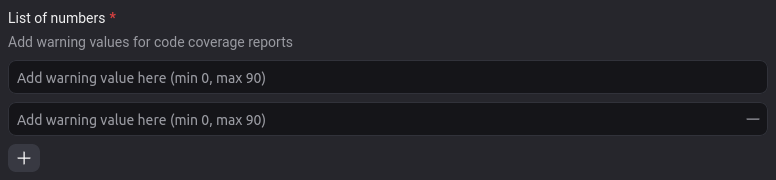
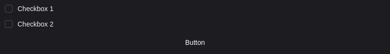
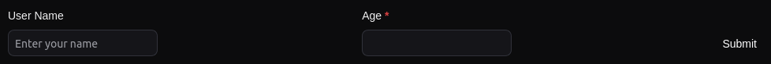

This reference lists the elements for creating custom user interface using snap-kit.

## Structure

The snap-kit JSON has a top-level structure with `object`, `body`, `type`, and `snap_kit_body` fields. The `snap_kit_body` field contains information regarding snap-kit's structure.

The `snap_kit_body` field has the following properties:

- `snap_in_id`: A unique identifier for the snap-kit.
- `snap_in_action_name`: The name of the action this snap-kit represents.
- `body`: An object that holds the actual snap-kit content in the form of `snaps`.

```json Example
{
  "object": "<source_id>",
  "body": "Giphy",
  "type": "timeline_comment",
  "snap_kit_body": {
    "snap_in_id": "<snap_in_id>",
    "snap_in_action_name": "giphy",
    "body": { "snaps": [] }
}
```

The `body` field contains an array of `snaps`. Each snap can have a `type`; and depending on the type, it has different properties.

Types in the following categories are available:

- User interface elements

- Form elements

- Layout elements

- Data pickers

## Action payloads

Snap-kit generates payloads when a user interacts with an actionable snap. The payload is sent to the backend and can be used to perform actions. The following snaps generate payloads:

- [Button](#button)
- [Checkboxes](#checkboxes)
- [Input](#input) and all its types ([Plain text input](#plain-text-input), [Number input](#number-input), [Email input](#email-input), [Rich text input](#rich-text-input))
- [List input](#list-input) and all its types ([String list input](#string-list-input), [Number list input](#number-list-input), [Email list input](#email-list-input))
- [Static select](#static-select)
- [Multi static select](#multi-static-select)
- [Radio buttons](#radio-buttons)
- [Toggle button](#toggle-button)
- [Upload input](#upload-input)
- [Form](#form)
- [Part picker](#part-picker)
- [Tag picker](#tag-picker)
- [User picker](#user-picker)

All actionable snaps share the same base payload structure.

```json Base payload structure
{
  "type": "<type of snap that generated the payload>",
  "action_id": "<the action identifier of the snap that generated the payload>",
  "action_type": "<the type of the action as defined in the snap>",
  "timestamp": "<timestamp as a string in ISO 8601 format>"
}
```

## Base types

Many elements share the same base properties. The base types these elements inherit from are described below.

<AccordionGroup>
  <Accordion title="Snap">
  A snap is the base type that all other snaps inherit from.

  _Properties_

  - `type` (required): Type of snap.
  - `block_id` (optional): A unique identifier for the snap. If not provided, a random ID is generated.
  </Accordion>

  <Accordion title="Action">
  Base interface for action components.

  _Action types_

  - **Remote action**: It triggers a backend API and is handled by the backend.
  - **Client action**: It triggers a client-side action and is handled by the client.

  _Properties_

  - `action_id` (required): An identifier for the action. It should be unique in the snap.
  - `action_type` (optional): Indicates whether the backend or client handles the action. This is mandatory to pass if you have an action to be performed. Possible values: `"remote"`, `"client"`.

  _Inherited properties_

  Inherited from [Snap](#snap):

  - `type` (required): Type of snap.
  - `block_id` (optional): A unique identifier for the snap. If not provided, a random ID is generated.
  </Accordion>
  
  <Accordion title="Focusable">
  Base interface for focusable components.

  _Properties_

  - `focus_on_load` (optional): Indicates whether the component should be focused on load or not. Only 1 item can have the property set to true in the snap. Defaults to `false`.
  </Accordion>
  <Accordion title="Placeholder">
  Base interface for components that can have a placeholder.

  _Properties_

  - `placeholder` (optional): A [Plain text](#plain-text) element that defines the placeholder text shown on the element.
  </Accordion>
  <Accordion title="Disabled">
  Base interface for components that can be disabled.

  _Properties_

  - `disabled` (optional): Indicates whether the element is disabled.
  </Accordion>
  <Accordion title="Hideable">
  Base interface for components that can be hidden.

  _Properties_

  - `hidden` (optional): Indicates whether the element is hidden.
  </Accordion>
  <Accordion title="Layout">
  Controls how the layout is displayed. Similar to `flexbox`.

  _Properties_

  - `direction` (optional): The direction of the layout. Similar to `flex-direction`. Possible values: `"row"`, `"column"`.
  - `alignment` (optional): The alignment of the layout. Similar to `align-items`. Possible values: `"start"`, `"center"`, `"end"`, `"baseline"`, `"stretch"`.
  - `justify` (optional): The justification of the layout. Similar to `justify-content`. Possible values: `"start"`, `"center"`, `"end"`, `"between"`, `"around"`, `"evenly"`.
  </Accordion>
</AccordionGroup>

## User interface elements
<AccordionGroup>
  <Accordion title="Button">
  A button that can be clicked to trigger an action. Works with [Actions](#actions) and [Form](#form) blocks.

  _Properties_

  - `text` (required): The text to be displayed on the button.
  - `style` (optional): The style of the button. Defaults to `"default"`. Possible values: `"default"`, `"primary"`, `"destructive"`.
  - `value` (required): The value associated with the button. It's sent along with the interaction payload.
  - `href` (optional): If the button is a link, this is the URL it links to.
  - `disabled` (optional): Disables the input and prevents changes to the value.
  - `disabled_text` (optional): The text that's shown on hover if the component is disabled.

  _Inherited properties_

  Inherited from [Snap](#snap):

  - `type` (required): The type of the button component, should be set to `"button"`.
  - `block_id` (optional): A unique identifier for the snap. If not provided, a random ID is generated.

  Inherited from [Action](#action):

  - `action_id` (required): An identifier for the action and is unique in the snap.
  - `action_type` (optional): Indicates whether the action is handled by the backend or client. This is mandatory to pass if you have an action to be performed. Possible values: `"remote"`, `"client"`.

  _Example_

  Button variants are displayed in a row using the [Card](#card) snap.

  

  ```json
  {
    "elements": [
      {
        "direction": "row",
        "elements": [
          {
            "action_id": "PRIMARY",
            "action_type": "remote",
            "style": "primary",
            "text": {
              "text": "PRIMARY",
              "type": "plain_text"
            },
            "type": "button",
            "value": "PRIMARY"
          },
          {
            "action_id": "SECONDARY",
            "action_type": "remote",
            "style": "secondary",
            "text": {
              "text": "SECONDARY",
              "type": "plain_text"
            },
            "type": "button",
            "value": "SECONDARY"
          },
          {
            "action_id": "DESTRUCTIVE",
            "action_type": "remote",
            "style": "destructive",
            "text": {
              "text": "DESTRUCTIVE",
              "type": "plain_text"
            },
            "type": "button",
            "value": "DESTRUCTIVE"
          },
          {
            "action_id": "TERTIARY",
            "action_type": "remote",
            "style": "tertiary",
            "text": {
              "text": "TERTIARY",
              "type": "plain_text"
            },
            "type": "button",
            "value": "TERTIARY"
          },
          {
            "action_id": "PRIMARY",
            "action_type": "remote",
            "disabled": true,
            "style": "primary",
            "text": {
              "text": "DISABLED",
              "type": "plain_text"
            },
            "type": "button",
            "value": "PRIMARY"
          }
        ],
        "type": "actions"
      }
    ],
    "type": "card"
  }
  ```

  _Action payload_

  Inherits `type`, `action_id`, `action_type` and `timestamp` from [Base payload](#base-payload), `type` is set to `"button"`.

  ```json
  {
    "type": "button",
    "action_id": "<the action identifier of the button>",
    "action_type": "<the type of the action as defined in the snap>",
    "timestamp": "<timestamp as a string in ISO 8601 format>",
    "value": "<the value associated with the button>"
  }
  ```

  ```json Example payload
  {
    "action_id": "PRIMARY",
    "action_type": "remote",
    "type": "button",
    "value": "PRIMARY",
    "timestamp": "2023-07-12T08:12:10.006Z"
  }
  ```
  </Accordion>

  <Accordion title="Divider">
  A divider component is used to separate blocks.

  _Properties_

  The divider component does not have any properties of its own.

  _Inherited properties_

  Inherited from [Snap](#snap):

  - `type` (required): The type of the divider component, should be set to `"divider"`.
  - `block_id` (optional): A unique identifier for the snap. If not provided, a random ID is generated.

  _Example_

  Divider is used in a form to separate a name input and a multi-select input.

  

  ```json
  {
    "elements": [
      {
        "action_id": "example_form",
        "elements": [
          {
            "element": {
              "action_id": "example_name",
              "placeholder": {
                "text": "Enter your name",
                "type": "plain_text"
              },
              "type": "plain_text_input"
            },
            "label": {
              "text": "Name",
              "type": "plain_text"
            },
            "type": "input_layout"
          },
          {
            "type": "divider"
          },
          {
            "element": {
              "action_id": "example_preferences",
              "options": [
                {
                  "text": {
                    "text": "Email",
                    "type": "plain_text"
                  },
                  "value": "email"
                },
                {
                  "text": {
                    "text": "Slack",
                    "type": "plain_text"
                  },
                  "value": "slack"
                },
                {
                  "text": {
                    "text": "Other",
                    "type": "plain_text"
                  },
                  "value": "other"
                }
              ],
              "type": "multi_static_select"
            },
            "label": {
              "text": "Select your preferred ways of communication",
              "type": "plain_text"
            },
            "type": "input_layout"
          },
          {
            "element": {
              "action_id": "example_other",
              "type": "plain_text_input"
            },
            "label": {
              "text": "Additional notes",
              "type": "plain_text"
            },
            "optional": true,
            "type": "input_layout"
          }
        ],
        "submit_action": {
          "action_id": "example_button",
          "style": "primary",
          "text": {
            "text": "Submit",
            "type": "plain_text"
          },
          "type": "button",
          "value": "SUBMIT"
        },
        "type": "form"
      }
    ],
    "type": "card"
  }
  ```

  </Accordion>
  
  <Accordion title="Image">
  An image block that displays an image. Works with [Content](#content) blocks.

  _Properties_

  - `image_url` (required): The URL of the image.
  - `alt_text` (required): The alt text to be displayed when the image can't be displayed. This shouldn't contain any markup.
  - `fill_container` (optional): Whether the image should stretch to fill the container while maintaining its aspect ratio.

  _Inherited properties_

  Inherited from [Snap](#snap):

  - `type` (required): The type of the image component, should be set to `"image"`.
  - `block_id` (optional): A unique identifier for the snap. If not provided, a random ID is generated.

  _Example_

  Image used in a card, with default display mode (`fill_container` not set).

  

  ```json
  {
    "elements": [
      {
        "alignment": "center",
        "elements": [
          {
            "text": "Default image display mode: Creating a group in DevRev",
            "type": "plain_text"
          },
          {
            "alt_text": "Group creation",
            "image_url": "https://docs.devrev.ai/_next/image?url=%2Fimg%2Fgroups.gif&w=750&q=75",
            "type": "image"
          }
        ],
        "type": "content"
      }
    ],
    "type": "card"
  }
  ```

  Image used in a card, with `fill_container` set.

  

  ```json
  {
    "elements": [
      {
        "alignment": "center",
        "elements": [
          {
            "text": "Fill container image display mode: Creating a group in DevRev",
            "type": "plain_text"
          },
          {
            "alt_text": "Group creation",
            "image_url": "https://docs.devrev.ai/_next/image?url=%2Fimg%2Fgroups.gif&w=750&q=75",
            "type": "image"
          }
        ],
        "type": "content"
      }
    ],
    "type": "card"
  }
  ```
  </Accordion>
  <Accordion title="Plain text">
  A plain text element is used to define unformatted text.

  _Properties_

  - `text` (required): The plain text content.

  _Inherited properties_

  Inherited from [Snap](#snap):

  - `type` (required): The type of the element, should be set to `"plain_text"`.
  - `block_id` (optional): A unique identifier for the snap. If not provided, a random ID is generated.

  _Example_

  

  ```json
  {
    "elements": [
      {
        "text": "Hello this is an example of a plain text element",
        "type": "plain_text"
      }
    ]
  }
  ```
  </Accordion>
  <Accordion title="Rich text">
  A rich text element is used to define formatted text.

  _Properties_

  - `text` (required): The rich text content.

  _Inherited properties_

  Inherited from [Snap](#snap):

  - `type` (required): The type of the element, should be set to `"rich_text"`.
  - `block_id` (optional): A unique identifier for the snap. If not provided, a random ID is generated.

  _Example_

  

  ```json
  {
    "text": "# Welcome to DevRev! \n[DevRev](https://devrev.ai)",
    "type": "rich_text"
  }
  ```
</Accordion>
<Accordion title="Table">

A table element used to present JSON structured data.

_Properties_

- `rows` (required): The values to be displayed in the table. The data should be provided as a JSON object, where each cell is a plaintext snap-kit component.
- `columns` (required): Columns are defined as an array of objects, where each object has two parameters: an optional header and a required field key, which defines which field from rows is shown in the defined column. If a key is not used, it means that the associated data from rows are not displayed in the table. The order of keys also defines the order in which values from rows are shown in the table.

_Inherited properties_

Inherited from [Snap](#snap):

- `type` (required): The type of the element, should be set to `"table"`.
- `block_id` (optional): A unique identifier for the snap. If not provided, a random ID is generated.

_Example_


```json
{
	"elements": [
		{
			"columns": [
				{
					"header": {
						"text": "Date",
						"type": "plain_text"
					},
					"key": "date"
				},
				{
					"header": {
						"text": "Status",
						"type": "plain_text"
					},
					"key": "status"
				},
				{
					"header": {
						"text": "Project title",
						"type": "plain_text"
					},
					"key": "title"
				}
			],
			"rows": [
				{
					"date": {
						"text": "2024-03-04",
						"type": "plain_text"
					},
					"hiddenField": {
						"text": "Hidden value",
						"type": "plain_text"
					},
					"status": {
						"text": "Completed",
						"type": "plain_text"
					},
					"title": {
						"text": "Project A",
						"type": "plain_text"
					}
				},
				{
					"date": {
						"text": "2024-03-05",
						"type": "plain_text"
					},
					"hiddenField": {
						"text": "hidden",
						"type": "plain_text"
					},
					"status": {
						"text": "In progress",
						"type": "plain_text"
					},
					"title": {
						"text": "Project B",
						"type": "plain_text"
					}
				},
				{
					"date": {
						"text": "2024-03-06",
						"type": "plain_text"
					},
					"hiddenField": {
						"text": "hidden",
						"type": "plain_text"
					},
					"status": {
						"text": "Pending",
						"type": "plain_text"
					},
					"title": {
						"text": "Project C",
						"type": "plain_text"
					}
				}
			],
			"type": "table"
		}
	]
}
```
  </Accordion>
</AccordionGroup>

## Form elements

<AccordionGroup>
  <Accordion title="Plain text option">
  Plain text options are a commonly shared component of different form elements. It's used to define an option in a form element.

  - `text` (required): A [Plain text](#plain-text) element representing the option.
  - `value` (required): A value assigned to the option.
  - `description` (optional): An optional [Plain text](#plain-text) element describing the option.
  </Accordion>

  <Accordion title="Checkboxes">
  A component that provides a group of checkboxes that allow a user to choose multiple items from a list of options. Works with [Input layout](#input-layout) and [Actions](#actions) blocks.

  _Properties_

  - `options` (required): A list of options that appears in a stack of checkboxes, of type [Plain text option](#plain-text-option).
  - `initial_options` (optional): The initially selected options.

  _Inherited properties_

  Inherited from [Snap](#snap):

  - `type` (required): The type of the checkbox group component, should be set to `"checkboxes"`.
  - `block_id` (optional): A unique identifier for the snap. If not provided, a random ID is generated.

  Inherited from [Action](#action):

  - `action_id` (required): An identifier for the action. Should be unique in the snap.
  - `action_type` (optional): Indicates whether the action is handled by the backend or client. This is mandatory to pass if you have an action to be performed. Possible values: `"remote"`, `"client"`.

  Inherited from [Focusable](#focusable):

  - `focus_on_load` (optional): Indicates whether the component should be focused on load or not. Only 1 item can have the property set to true in the snap. Defaults to `false`.

  Inherited from [Disabled](#disabled):

  - `disabled` (optional): Indicates whether the element is disabled.

  _Example_

  

  ```json
  {
    "elements": [
      {
        "action_id": "checkboxes",
        "action_type": "remote",
        "options": [
          {
            "description": {
              "text": "Description for option 1",
              "type": "plain_text"
            },
            "text": {
              "text": "Option 1",
              "type": "plain_text"
            },
            "value": "option_1"
          },
          {
            "description": {
              "text": "Description for option 1",
              "type": "plain_text"
            },
            "text": {
              "text": "Option 2",
              "type": "plain_text"
            },
            "value": "option_2"
          }
        ],
        "type": "checkboxes"
      },
      {
        "action_id": "checkboxes",
        "action_type": "remote",
        "disabled": true,
        "options": [
          {
            "description": {
              "text": "Description for option 1",
              "type": "plain_text"
            },
            "text": {
              "text": "Disabled option 1",
              "type": "plain_text"
            },
            "value": "option_1"
          },
          {
            "description": {
              "text": "Description for option 1",
              "type": "plain_text"
            },
            "text": {
              "text": "Disabled option 2",
              "type": "plain_text"
            },
            "value": "option_2"
          }
        ],
        "type": "checkboxes"
      }
    ],
    "type": "actions"
  }
  ```

  _Action payload_

  Inherits `type`, `action_id`, `action_type`, and `timestamp` from [Base payload](#base-payload), `type` is set to `"checkboxes"`.

  ```json
  {
    "type": "checkboxes",
    "action_id": "<the action identifier of the checkboxes>",
    "action_type": "<the type of the action as defined in the snap>",
    "timestamp": "<timestamp as a string in ISO 8601 format>",
    "value": ["<array of selected plain text option objects>"]
  }
  ```

  ```json Example payload
  {
    "action_id": "checkboxes",
    "action_type": "remote",
    "type": "checkboxes",
    "value": [
      {
        "description": {
          "text": "Description for option 1",
          "type": "plain_text"
        },
        "text": { "text": "Option 2", "type": "plain_text" },
        "value": "option_2"
      }
    ],
    "timestamp": "2023-07-12T08:14:52.370Z"
  }
  ```

  </Accordion>
  
  <Accordion title="Input">
  There are 4 supported input types:

  - Plain text input
  - Number input
  - Email input
  - Rich text input

  _Properties_

  The input component does not have any properties of its own. See specific variants below for their properties.

  _Inherited properties_

  Inherited from [Snap](#snap):

  - `type` (required): Type of the input component. **Should be set according to the input type, see below.**
  - `block_id` (optional): A unique identifier for the snap. If not provided, a random ID is generated.

  Inherited from [Action](#action):

  - `action_id` (required): An identifier for the action. Should be unique in the snap.
  - `action_type` (optional): Indicates whether the action is handled by the backend or client. This is mandatory to pass if you have an action to be performed. Possible values: `"remote"`, `"client"`.

  Inherited from [Focusable](#focusable):

  - `focus_on_load` (optional): Indicates whether the component should be focused on load or not. Only 1 item can have the property set to true in the snap. Defaults to `false`.

  Inherited from [Placeholder](#placeholder):

  - `placeholder` (optional): A [Plain text](#plain-text) element that defines the placeholder text shown on the element.

  Inherited from [Disabled](#disabled):

  - `disabled` (optional): Indicates whether the element is disabled.

  **Plain text input**

  A plain-text input, similar to the HTML `<input>` tag, creates a field where a user can enter freeform data. It can appear as a single-line field. Works with [Input layout](#input-layout) blocks.

  _Inherited properties_

  Inherited from [Snap](#snap):

  - `type` (required): The type of the input component, should be set to `"plain_text_input"`.

  _Additional properties_

  - `initial_value` (optional): The initial value in the input when it's loaded.
  - `multiline` (optional): Indicates whether the input should allow multiple lines of text. Defaults to `false`.
  - `min_length` (optional): The minimum text length, can't be greater than `max_length`.
  - `max_length` (optional): The maximum text length, can't be less than `min_length`.
  - `resize` (optional): Indicates whether the input should be resizable. Defaults to `false`.

  _Example_

  

  ```json
  {
    "element": {
      "action_id": "name",
      "min_length": 10,
      "placeholder": {
        "text": "Enter your name",
        "type": "plain_text"
      },
      "type": "plain_text_input"
    },
    "hint": {
      "text": "Please enter your name",
      "type": "plain_text"
    },
    "label": {
      "text": "User name",
      "type": "plain_text"
    },
    "optional": true,
    "type": "input_layout"
  }
  ```

  _Action payload_

  Inherits `type`, `action_id`, `action_type` and `timestamp` from [Base payload](#base-payload), `type` is set to `"plain_text_input"`.

  ```json
  {
    "type": "plain_text_input",
    "action_id": "<the action identifier of the plain text input>",
    "action_type": "<the type of the action as defined in the Snap>",
    "timestamp": "<timestamp as a string in ISO 8601 format>",
    "value": "<the value of the input>"
  }
  ```

  ```json Example payload
  {
    "type": "plain_text_input",
    "action_id": "name",
    "action_type": "remote",
    "timestamp": "2023-07-12T08:17:43.887Z",
    "value": "Chuck Norris"
  }
  ```

  **Number input**

  A number input, similar to the HTML `<input>` tag, creates a field where a user can enter numbers. Works with [Input layout](#input-layout) blocks.

  _Inherited properties_

  Inherited from [Snap](#snap):

  - `type` (required): The type of the input component, should be set to `"number_input"`.

  _Additional properties_

  - `initial_value` (optional): The initial value in the input when it's loaded.
  - `min_value` (optional): The minimum value, can't be greater than `max_value`.
  - `max_value` (optional): The maximum value, can't be less than `min_value`.

  _Example_

  

  ```json
  {
    "element": {
      "action_id": "age",
      "max_value": 120,
      "min_value": 10,
      "type": "number_input"
    },
    "label": {
      "text": "Age",
      "type": "plain_text"
    },
    "type": "input_layout"
  }
  ```

  _Action payload_

  Inherits `type`, `action_id`, `action_type`, and `timestamp` from [Base payload](#base-payload), `type` is set to `"number_input"`.

  ```json
  {
    "type": "number_input",
    "action_id": "<the action identifier of the number input>",
    "action_type": "<the type of the action as defined in the Snap>",
    "timestamp": "<timestamp as a string in ISO 8601 format>",
    "value": "<the value of the input>"
  }
  ```

  ```json Example payload
  {
    "type": "number_input",
    "action_id": "age",
    "action_type": "remote",
    "timestamp": "2023-07-12T08:17:43.887Z",
    "value": "83"
  }
  ```

  **Email input**

  An email input, similar to the HTML `<input>` tag, creates a field where a user can enter email. Works with [Input layout](#input-layout) blocks.

  _Inherited properties_

  Inherited from [Snap](#snap):

  - `type` (required): The type of the input component, should be set to `"email_text_input"`.

  _Additional properties_

  - `initial_value` (optional): The initial value in the input when it's loaded.

  _Example_

  

  ```json
  {
    "element": {
      "action_id": "email",
      "placeholder": {
        "text": "example@devrev.ai",
        "type": "plain_text"
      },
      "type": "email_text_input"
    },
    "hint": {
      "text": "Please enter your email",
      "type": "plain_text"
    },
    "label": {
      "text": "Email",
      "type": "plain_text"
    },
    "type": "input_layout"
  }
  ```

  _Action payload_

  Inherits `type`, `action_id`, `action_type` and `timestamp` from [Base payload](#base-payload), `type` is set to `"email_text_input"`.

  ```json
  {
    "type": "email_text_input",
    "action_id": "<the action identifier of the email text input>",
    "action_type": "<the type of the action as defined in the Snap>",
    "timestamp": "<timestamp as a string in ISO 8601 format>",
    "value": "<the value of the input>"
  }
  ```

  ```json Example payload
  {
    "type": "email_text_input",
    "action_id": "email",
    "action_type": "remote",
    "timestamp": "2023-07-12T08:17:43.887Z",
    "value": "chuck@norris.com"
  }
  ```

  **Rich text input**

  A rich text input shows a rich text editor where the user can enter formatted text (Markdown). Works with [Input layout](#input-layout) blocks.

  _Inherited properties_

  Inherited from [Snap](#snap):

  - `type` (required): The type of the input component, should be set to `"rich_text_input"`.

  _Additional properties_

  - `initial_value` (optional): The initial value in the input when it's loaded.

  _Example_

  

  The following video shows the rich text input in action.

  <video controls width="100%">
    <source src="https://github.com/devrev/fern-api-docs/assets/74637789/226f6818-fc62-41b9-84dd-d800e12a3458" type="video/mp4" />
  </video>

  ```json
  {
    "element": {
      "action_id": "notes",
      "placeholder": {
        "text": "Your notes go here",
        "type": "plain_text"
      },
      "type": "rich_text_input"
    },
    "hint": {
      "text": "Please enter your notes",
      "type": "plain_text"
    },
    "label": {
      "text": "Notes",
      "type": "plain_text"
    },
    "optional": true,
    "type": "input_layout"
  }
  ```

  _Action payload_

  Inherits `type`, `action_id`, `action_type` and `timestamp` from [Base payload](#base-payload), `type` is set to `"rich_text_input"`.

  ```json
  {
    "type": "rich_text_input",
    "action_id": "<the action identifier of the rich text input>",
    "action_type": "<the type of the action as defined in the Snap>",
    "timestamp": "<timestamp as a string in ISO 8601 format>",
    "value": "<the value (raw Markdown) of the input>"
  }
  ```

  ```json Example payload
  {
    "type": "rich_text_input",
    "action_id": "notes",
    "action_type": "remote",
    "timestamp": "2023-07-19T10:54:20.331Z",
    "value": "**Title**

  *Italic*

  ~~Strikethrough~~

  `A piece of code`

  > A quote

  - Unordered 1
  - Unordered 2

  1. Ordered 1
  2. Ordered 2"
  }
  ```

  </Accordion>
  <Accordion title="List input">
  There are 3 supported list input types:

  - String list input
  - Number list input
  - Email list input
  
  _Properties_

  The list input component does not have any properties of its own. See specific variants below for their properties.

  _Inherited properties_

  Inherited from [Snap](#snap):

  - `type` (required): Type of the list input component. **Should be set according to the list input type, see below.**
  - `block_id` (optional): A unique identifier for the snap. If not provided, a random ID is generated.

  Inherited from [Action](#action):

  - `action_id` (required): An identifier for the action. Should be unique in the snap.
  - `action_type` (optional): Indicates whether the action is handled by the backend or client. This is mandatory to pass if you have an action to be performed. Possible values: `"remote"`, `"client"`.

  Inherited from [Placeholder](#placeholder):

  - `placeholder` (optional): A [Plain text](#plain-text) element that defines the placeholder text shown on the element.

  Inherited from [Disabled](#disabled):

  - `disabled` (optional): Indicates whether the element is disabled.

  **String list input**

  A string list input allows users to enter a list of text items. Works with [Input layout](#input-layout) blocks.

  _Inherited properties_

  Inherited from [Snap](#snap):

  - `type` (required): The type of the input component, should be set to `"string_list"`.

  _Additional properties_

  - `min_items` (optional): The minimum number of items that can be added. Defaults to 1.
  - `max_items` (optional): The maximum number of items that can be added.
  - `multiline` (optional): Indicates whether the input should allow multiple lines of text. Defaults to `false`.
  - `min_item_length` (optional): The minimum text length of the inputs, can't be greater than `max_item_length`.
  - `max_item_length` (optional): The maximum text length of the inputs, can't be less than `min_item_length`.
  - `initial_values` (optional): The initial values in the inputs when they are loaded. This is an array of strings. If `min_items` or `max_items` are set, the length of the array should be within the range.

  _Example_

  Standard string list input with a minimum of 1 item, maximum of 3 items, minimum item length set to 3 and maximum item length set to 15.

  

  ```json
  {
    "element": {
      "action_id": "keywords",
      "max_items": 3,
      "min_items": 1,
      "max_item_length": 15,
      "min_item_length": 3,
      "placeholder": {
        "text": "Add keyword here",
        "type": "plain_text"
      },
      "type": "string_list"
    },
    "hint": {
      "text": "When a customer includes these keywords in a Slack message, they are prompted to send the message to your DevRev inbox.",
      "type": "plain_text"
    },
    "label": {
      "text": "List of strings",
      "type": "plain_text"
    },
    "type": "input_layout"
  }
  ```

  Multiline string list input with a minimum of 1 item and a maximum of 2 items.

  

  ```json
  {
    "element": {
      "action_id": "multiline",
      "max_items": 2,
      "min_items": 1,
      "multiline": true,
      "placeholder": {
        "text": "Add a keyword here",
        "type": "plain_text"
      },
      "type": "string_list"
    },
    "hint": {
      "text": "When a customer includes these multiline keywords in a Slack message, they are prompted to send the message to your DevRev inbox.",
      "type": "plain_text"
    },
    "label": {
      "text": "List of strings",
      "type": "plain_text"
    },
    "type": "input_layout"
  }
  ```

  _Action payload_

  Inherits `type`, `action_id`, `action_type` and `timestamp` from [Base payload](#base-payload), `type` is set to `"string_list"`.

  ```json
  {
    "type": "string_list",
    "action_id": "<the action identifier of the string list input>",
    "action_type": "<the type of the action as defined in the Snap>",
    "timestamp": "<timestamp as a string in ISO 8601 format>",
    "value": ["<an array of strings as inputted by the user>"]
  }
  ```

  ```json Example payload: Standard string list input
  {
    "type": "string_list",
    "action_id": "keywords",
    "action_type": "remote",
    "timestamp": "2023-07-21T05:33:52.182Z",
    "value": ["hello", "this is", "a test"]
  }
  ```

  ```json Example payload: Multiline string list input.
  {
    "type": "string_list",
    "action_id": "multiline",
    "action_type": "remote",
    "timestamp": "2023-07-21T05:33:52.182Z",
    "value": ["Hello this
  is a multiline string", "And here
  is another
  one"]
  }
  ```

  **Number list input**

  A list of numbers input allows users to enter a list of numeric items. Works with [Input layout](#input-layout) blocks.

  _Inherited properties_

  Inherited from [Snap](#snap):

  - `type` (required): The type of the input component, should be set to `"number_list"`.

  _Additional properties_

  - `min_items` (optional): The minimum number of items that can be added.
  - `max_items` (optional): The maximum number of items that can be added.
  - `min_item_value` (optional): The minimum value of the inputs, can't be greater than `max_item_value`.
  - `max_item_value` (optional): The maximum value of the inputs, can't be less than `min_item_value`.
  - `initial_values` (optional): The initial values in the inputs when they are loaded. This is an array of strings. If `min_items` or `max_items` are set, the length of the array should be within the range.

  _Example_

  

  ```json
  {
    "element": {
      "action_id": "numbers",
      "max_item_value": 90,
      "min_item_value": 0,
      "placeholder": {
        "text": "Add warning value here (min 0, max 90)",
        "type": "plain_text"
      },
      "type": "number_list"
    },
    "hint": {
      "text": "Add warning values for code coverage reports",
      "type": "plain_text"
    },
    "label": {
      "text": "List of numbers",
      "type": "plain_text"
    },
    "type": "input_layout"
  }
  ```

  _Action payload_

  Inherits `type`, `action_id`, `action_type` and `timestamp` from [Base payload](#base-payload), `type` is set to `"number_list"`.

  ```json
  {
    "type": "number_list",
    "action_id": "<the action identifier of the number list input>",
    "action_type": "<the type of the action as defined in the Snap>",
    "timestamp": "<timestamp as a string in ISO 8601 format>",
    "value": ["<an array of numbers as strings as inputted by the user>"]
  }
  ```

  ```json Example payload
  {
    "type": "number_list",
    "action_id": "numbers",
    "action_type": "remote",
    "timestamp": "2023-07-21T05:33:52.182Z",
    "value": ["25", "42", "60"]
  }
  ```

  **Email list input**

  A list of email input allows users to enter a list of emails. Works with [Input layout](#input-layout) blocks.

  _Inherited properties_

  Inherited from [Snap](#snap):

  - `type` (required): The type of the input component, should be set to `"email_list"`.

  _Additional properties_

  - `min_items` (optional): The minimum number of items that can be added.
  - `max_items` (optional): The maximum number of items that can be added.
  - `initial_values` (optional): The initial values in the inputs when they are loaded. This is an array of strings. If `min_items` or `max_items` are set, the length of the array should be within the range.

  _Example_

  

  ```json
  {
    "element": {
      "action_id": "emails",
      "placeholder": {
        "text": "Enter email here",
        "type": "plain_text"
      },
      "type": "email_list"
    },
    "hint": {
      "text": "When these emails are included in a Slack message, they automatically receive an email notification.",
      "type": "plain_text"
    },
    "label": {
      "text": "List of emails",
      "type": "plain_text"
    },
    "type": "input_layout"
  }
  ```

  _Action payload_

  Inherits `type`, `action_id`, `action_type` and `timestamp` from [Base payload](#base-payload), `type` is set to `"email_list"`.

  ```json
  {
    "type": "email_list",
    "action_id": "<the action identifier of the email list input>",
    "action_type": "<the type of the action as defined in the Snap>",
    "timestamp": "<timestamp as a string in ISO 8601 format>",
    "value": ["<an array of emails as strings as inputted by the user>"]
  }
  ```

  ```json Example payload
  {
    "type": "email_list",
    "action_id": "emails",
    "action_type": "remote",
    "timestamp": "2023-07-21T05:33:52.182Z",
    "value": ["hello@hello.com", "example@example.com", "bonjour@hello.com"]
  }
  ```
  </Accordion>
  <Accordion title="Static select">
  A select menu that allows a user to choose one item from a list of options. Works with [Input layout](#input-layout) and [Actions](#actions) blocks.

  _Properties_

  - `options` (required): A list of options that appear in the menu, of type [Plain text option](#plain-text-option).
  - `initial_selected_option` (optional): The initial option that's selected when the element is loaded. A single option that exactly matches one of the options within `options`.

  _Inherited properties_

  Inherited from [Snap](#snap):

  - `type` (required): Type of the static select component, should be set to `"static_select"`.
  - `block_id` (optional): A unique identifier for the snap. If not provided, a random ID is generated.

  Inherited from [Action](#action):

  - `action_id` (required): An identifier for the action. Should be unique in the snap.
  - `action_type` (optional): Indicates whether the action is handled by the backend or client. This is mandatory to pass if you have an action to be performed. Possible values: `"remote"`, `"client"`.

  Inherited from [Focusable](#focusable):

  - `focus_on_load` (optional): Indicates whether the component should be focused on load or not. Only 1 item can have the property set to true in the snap. Defaults to `false`.

  Inherited from [Placeholder](#placeholder):

  - `placeholder` (optional): A [Plain text](#plain-text) element that defines the placeholder text shown on the element.

  Inherited from [Disabled](#disabled):

  - `disabled` (optional): Indicates whether the element is disabled.

  _Example_

  A static select snap with 4 options.

  

  ```json
  {
    "action_id": "static_select",
    "action_type": "remote",
    "initial_selected_option": {
      "text": {
        "text": "Forrest Gump",
        "type": "plain_text"
      },
      "value": "forrest-gump"
    },
    "options": [
      {
        "text": {
          "text": "Forrest Gump",
          "type": "plain_text"
        },
        "value": "forrest-gump"
      },
      {
        "text": {
          "text": "The Shawshank Redemption",
          "type": "plain_text"
        },
        "value": "the-shawshank-redemption"
      },
      {
        "text": {
          "text": "The Godfather",
          "type": "plain_text"
        },
        "value": "the-godfather"
      },
      {
        "text": {
          "text": "The Dark Knight",
          "type": "plain_text"
        },
        "value": "the-dark-knight"
      }
    ],
    "type": "static_select"
  }
  ```

  _Action payload_

  Inherits `type`, `action_id`, `action_type`, and `timestamp` from [Base payload](#base-payload), `type` is set to `"static_select"`.

  ```json
  {
    "type": "static_select",
    "action_id": "<the action identifier of the static select>",
    "action_type": "<the type of the action as defined in the Snap>",
    "timestamp": "<timestamp as a string in ISO 8601 format>",
    "value": "<selected plain text option object>"
  }
  ```

  ```json Example payload
  {
    "action_id": "static_select",
    "action_type": "remote",
    "type": "static_select",
    "value": {
      "text": { "text": "The Godfather", "type": "plain_text" },
      "value": "the-godfather"
    },
    "timestamp": "2023-07-12T08:21:06.027Z"
  }
  ```

  </Accordion>
  <Accordion title="Multi static select">
  A select menu that allows a user to choose multiple items from a list of options. Works with [Input layout](#input-layout) and [Actions](#actions) blocks.

  _Properties_

  - `options` (required): A list of options that appear in the menu, of type [Plain text option](#plain-text-option).
  - `initial_selected_options` (optional): The initial options that are selected when the element is loaded. Each of them should exactly match one of the options within `options`.
  - `max_selected_items` (optional): The maximum number of items that can be selected.

  _Inherited properties_

  Inherited from [Snap](#snap):

  - `type` (required): The type of the multi-static select component, should be set to `"multi_static_select"`.
  - `block_id` (optional): A unique identifier for the snap. If not provided, a random ID is generated.

  Inherited from [Action](#action):

  - `action_id` (required): An identifier for the action. Should be unique in the snap.
  - `action_type` (optional): Indicates whether the action is handled by the backend or client. This is mandatory to pass if you have an action to be performed. Possible values: `"remote"`, `"client"`.

  Inherited from [Focusable](#focusable):

  - `focus_on_load` (optional): Indicates whether the component should be focused on load or not. Only 1 item can have the property set to true in the snap. Defaults to `false`.

  Inherited from [Placeholder](#placeholder):

  - `placeholder` (optional): A [Plain text](#plain-text) element that defines the placeholder text shown on the element.

  Inherited from [Disabled](#disabled):

  - `disabled` (optional): Indicates whether the element is disabled.

  _Example_

  A multi-static select snap with 4 options.

  

  ```json
  {
    "action_id": "multi_static_select",
    "action_type": "remote",
    "initial_selected_options": [
      {
        "text": {
          "text": "Forrest Gump",
          "type": "plain_text"
        },
        "value": "forrest-gump"
      }
    ],
    "options": [
      {
        "text": {
          "text": "Forrest Gump",
          "type": "plain_text"
        },
        "value": "forrest-gump"
      },
      {
        "text": {
          "text": "The Shawshank Redemption",
          "type": "plain_text"
        },
        "value": "the-shawshank-redemption"
      },
      {
        "text": {
          "text": "The Godfather",
          "type": "plain_text"
        },
        "value": "the-godfather"
      },
      {
        "text": {
          "text": "The Dark Knight",
          "type": "plain_text"
        },
        "value": "the-dark-knight"
      }
    ],
    "type": "multi_static_select"
  }
  ```

  _Action payload_

  Inherits `type`, `action_id`, `action_type`, and `timestamp` from [Base payload](#base-payload), `type` is set to `"multi_static_select"`.

  ```json
  {
    "type": "multi_static_select",
    "action_id": "<the action identifier of the multi-static select>",
    "action_type": "<the type of the action as defined in the Snap>",
    "timestamp": "<timestamp as a string in ISO 8601 format>",
    "value": ["<array of selected plain text option objects>"]
  }
  ```

  ```json Example payload
  {
    "action_id": "multi_static_select",
    "action_type": "remote",
    "type": "multi_static_select",
    "value": [
      {
        "text": { "text": "Forrest Gump", "type": "plain_text" },
        "value": "forrest-gump"
      },
      {
        "text": { "text": "The Dark Knight", "type": "plain_text" },
        "value": "the-dark-knight"
      }
    ],
    "timestamp": "2023-07-12T08:21:24.700Z"
  }
  ```

  </Accordion>
  <Accordion title="Radio button">
  List of radio inputs that allow a user to choose one item from a list of options. Works with [input layout](#input-layout) and [actions](#actions) blocks.

  _Properties_

  - `options` (required): A list of options that appear in a stack of radio inputs, of type [plain text option](#plain-text-option).
  - `initial_selected_option` (optional): The initial option that's selected when the element is loaded. A single option that exactly matches one of the options within `options`.

  _Inherited properties_

  Inherited from [Snap](#snap):

  - `type` (required): Type of the radio button group component, should be set to `"radio_buttons"`.
  - `block_id` (optional): A unique identifier for the snap. If not provided, a random ID is generated.

  Inherited from [Action](#action):

  - `action_id` (required): An identifier for the action. Should be unique in the snap.
  - `action_type` (optional): Indicates whether the action is handled by the backend or client. This is mandatory to pass if you have an action to be performed. Possible values: `"remote"`, `"client"`.

  Inherited from [Focusable](#focusable):

  - `focus_on_load` (optional): Indicates whether the component should be focused on load or not. Only 1 item can have the property set to true in the snap. Defaults to `false`.

  Inherited from [Disabled](#disabled):

  - `disabled` (optional): Indicates whether the element is disabled.

  _Example_

  A radio button snap with 3 options.

  

  ```json
  {
    "action_id": "in-app",
    "action_type": "remote",
    "options": [
      {
        "text": {
          "text": "Important updates only (Mentions & assignments)",
          "type": "plain_text"
        },
        "value": "imp"
      },
      {
        "text": {
          "text": "All new updates",
          "type": "plain_text"
        },
        "value": "all"
      },
      {
        "text": {
          "text": "Never",
          "type": "plain_text"
        },
        "value": "none"
      }
    ],
    "type": "radio_buttons"
  }
  ```

  _Action payload_

  Inherits `type`, `action_id`, `action_type` and `timestamp` from [Base payload](#base-payload), `type` is set to `"radio_buttons"`.

  ```json
  {
    "type": "radio_buttons",
    "action_id": "<the action identifier of the radio buttons>",
    "action_type": "<the type of the action as defined in the Snap>",
    "timestamp": "<timestamp as a string in ISO 8601 format>",
    "value": "<selected plain text option object>"
  }
  ```

  ```json Example payload
  {
    "action_id": "in-app",
    "action_type": "remote",
    "type": "radio_buttons",
    "value": {
      "text": { "text": "All new updates", "type": "plain_text" },
      "value": "all"
    },
    "timestamp": "2023-07-12T08:21:46.621Z"
  }
  ```

  </Accordion>
  <Accordion title="Toggle button">
  Toggles allow users to switch between two possible states. Works with [Input layout](#input-layout) and [Actions](#actions) blocks.

  _Properties_

  - `initial_value` (optional): The initial value of the toggle (a boolean).
  - `description` (optional): A [Plain text](#plain-text) element that defines the description shown below the toggle.

  _Inherited properties_

  Inherited from [Snap](#snap):

  - `type` (required): The type of the toggle button component, should be set to `"toggle"`.
  - `block_id` (optional): A unique identifier for the snap. If not provided, a random ID is generated.

  Inherited from [Action](#action):

  - `action_id` (required): An identifier for the action. Should be unique in the snap.
  - `action_type` (optional): Indicates whether the action is handled by the backend or client. This is mandatory to pass if you have an action to be performed. Possible values: `"remote"`, `"client"`.

  Inherited from [Focusable](#focusable):

  - `focus_on_load` (optional): Indicates whether the component should be focused on load or not. Only 1 item can have the property set to true in the snap. Defaults to `false`.

  Inherited from [Disabled](#disabled):

  - `disabled` (optional): Indicates whether the element is disabled.

  _Example_

  

  ```json
  {
    "elements": [
      {
        "elements": [
          {
            "action_id": "toggle",
            "description": {
              "text": "This is a toggle",
              "type": "plain_text"
            },
            "type": "toggle"
          },
          {
            "action_id": "toggle_checked",
            "description": {
              "text": "This is a checked toggle",
              "type": "plain_text"
            },
            "initial_value": true,
            "type": "toggle"
          },
          {
            "action_id": "toggle_disabled",
            "description": {
              "text": "This is a disabled toggle",
              "type": "plain_text"
            },
            "disabled": true,
            "type": "toggle"
          }
        ],
        "type": "actions"
      }
    ],
    "type": "card"
  }
  ```

  _Action payload_

  Inherits `type`, `action_id`, `action_type` and `timestamp` from [Base payload](#base-payload), `type` is set to `"toggle"`.

  ```json
  {
    "type": "toggle",
    "action_id": "<the action identifier of the toggle>",
    "action_type": "<the type of the action as defined in the snap>",
    "timestamp": "<timestamp as a string in ISO 8601 format>",
    "value": "<boolean indicating the state of the toggle>"
  }
  ```

  ```json Example payload
  {
    "action_id": "toggle",
    "action_type": "remote",
    "type": "toggle",
    "value": true,
    "timestamp": "2023-07-12T08:22:10.723Z"
  }
  ```

  </Accordion>
  <Accordion title="Upload input">
  A component that allows a user to upload a file. Works with [Input layout](#input-layout) and [Actions](#actions) blocks.

  _Properties_

  - `upload_button` (required): A button that can be clicked to upload files.
  - `min_files` (optional): The minimum number of files that can be uploaded.
  - `max_files` (optional): The maximum number of files that can be uploaded.
  - `initial_artifacts_ids` (optional): The initial artifacts that are selected when the element is loaded. A list of DONv2 IDs.

  _Inherited properties_

  Inherited from [Snap](#snap):

  - `type` (required): Type of the upload input component, should be set to `"upload"`.
  - `block_id` (optional): A unique identifier for the snap. If not provided, a random ID is generated.

  Inherited from [Action](#action):

  - `action_id` (required): An identifier for the action. Should be unique in the snap.
  - `action_type` (optional): Indicates whether the action is handled by the backend or client. This is mandatory to pass if you have an action to be performed. Possible values: `"remote"`, `"client"`.

  Inherited from [Focusable](#focusable):

  - `focus_on_load` (optional): Indicates whether the component should be focused on load or not. Only 1 item can have the property set to true in the snap. Defaults to `false`.

  Inherited from [Placeholder](#placeholder):

  - `placeholder` (optional): A [Plain text](#plain-text) element that defines the placeholder text shown on the element.

  Inherited from [Disabled](#disabled):

  - `disabled` (optional): Indicates whether the element is disabled.

  _Example_

  

  ```json
  {
    "elements": [
      {
        "elements": [
          {
            "action_id": "upload",
            "action_type": "remote",
            "max_files": 5,
            "min_files": 1,
            "type": "upload",
            "upload_button": {
              "action_id": "upload_btn",
              "style": "primary",
              "text": {
                "text": "Upload",
                "type": "plain_text"
              },
              "type": "button",
              "value": "upload"
            }
          }
        ],
        "type": "actions"
      }
    ],
    "type": "card"
  }
  ```

  _Action payload_

  Inherits `type`, `action_id`, `action_type` and `timestamp` from [Base payload](#base-payload), `type` is set to `"upload"`.

  ```json
  {
    "type": "upload",
    "action_id": "<the action identifier of the upload input>",
    "action_type": "<the type of the action as defined in the snap>",
    "timestamp": "<timestamp as a string in ISO 8601 format>",
    "value": ["<an array of artifact IDs as strings>"]
  }
  ```

  ```json Example payload
  {
    "action_id": "upload",
    "action_type": "remote",
    "type": "upload",
    "value": [
      "don:core:dvrv-us-1:devo/H66a8LUt:artifact/5",
      "don:core:dvrv-us-1:devo/H66a8LUt:artifact/6"
    ],
    "timestamp": "2023-07-12T08:25:47.451Z"
  }
  ```

  </Accordion>
</AccordionGroup>

## Layout elements
<AccordionGroup>
  <Accordion title="Actions">
Used when you want the user to interact without filling out a form. Similar to the [Form](#form) block but without a submit button. It contains an array of `elements`.

_Properties_

- `elements` (required): An array of elements. See the list of allowed elements below.
- `disable_on_action` (optional): A boolean indicating whether all elements in the actions block should be disabled when one of the elements is interacted with. When the action is completed, the elements are re-enabled. Defaults to `false`. A use case for enabling this is if you have multiple actions that shouldn't be executed concurrently or are incompatible with each other. An example of this would be a snap-in for selecting a meal for a company event. When the user selects a meal, the other meal options should be disabled until the order is placed. After that, the snap-kit can be updated with the information about the selection.

_Inherited properties_

Inherited from [Snap](#snap):

- `type` (required): The type of the actions component, should be set to `"actions"`.
- `block_id` (optional): A unique identifier for the snap. If not provided, a random ID is generated.

Inherited from [Layout](#layout):

- `direction` (optional): The direction of the layout. Similar to `flex-direction`. Possible values: `"row"`, `"column"`.
- `alignment` (optional): The alignment of the layout. Similar to `align-items`. Possible values: `"start"`, `"center"`, `"end"`, `"baseline"`, `"stretch"`.
- `justify` (optional): The justification of the layout. Similar to `justify-content`. Possible values: `"start"`, `"center"`, `"end"`, `"between"`, `"around"`, `"evenly"`.

**Allowed elements**

The `elements` array can contain the following snaps:

- [Button](#button)
- [Checkboxes](#checkboxes)
- [Radio buttons](#radio-buttons)
- [Actions](#actions)
- [Static select](#static-select)
- [Multi static select](#multi-static-select)
- [Divider](#divider)
- [Tag picker](#tag-picker)
- [User picker](#user-picker)
- [Part picker](#part-picker)
- [Toggle button](#toggle-button)
- [Upload input](#upload-input)

_Example_



```json
{
  "elements": [
    {
      "action_id": "actions",
      "action_type": "remote",
      "options": [
        {
          "text": {
            "text": "Checkbox 1",
            "type": "plain_text"
          },
          "value": "checkbox_1"
        },
        {
          "text": {
            "text": "Checkbox 2",
            "type": "plain_text"
          },
          "value": "checkbox_2"
        }
      ],
      "type": "checkboxes"
    },
    {
      "action_id": "submit",
      "action_type": "remote",
      "style": "primary",
      "text": {
        "text": "Button",
        "type": "plain_text"
      },
      "type": "button",
      "value": "submit"
    }
  ],
  "type": "actions"
}
```

The following video shows the behavior of the Actions block with `disable_on_action` set to `true`.

<video controls width="100%">
  <source src="https://github.com/devrev/fern-api-docs/assets/74637789/09b5905c-be64-48d6-b3bf-ed7cae53af57" type="video/mp4" />
</video>

```json
{
  "elements": [
    {
      "elements": [
        {
          "text": "This is an example of an Actions snap with disable_on_action set to true. When you click one of the buttons, the other buttons are disabled until the action finishes.",
          "type": "plain_text"
        }
      ],
      "type": "content"
    },
    {
      "direction": "row",
      "disable_on_action": true,
      "elements": [
        {
          "action_id": "button_1",
          "action_type": "remote",
          "style": "primary",
          "text": {
            "text": "Button 1",
            "type": "plain_text"
          },
          "type": "button",
          "value": "button_1"
        },
        {
          "action_id": "button_2",
          "action_type": "remote",
          "style": "secondary",
          "text": {
            "text": "Button 2",
            "type": "plain_text"
          },
          "type": "button",
          "value": "button_2"
        },
        {
          "action_id": "button_3",
          "action_type": "remote",
          "style": "destructive",
          "text": {
            "text": "Button 3",
            "type": "plain_text"
          },
          "type": "button",
          "value": "button_3"
        }
      ],
      "type": "actions"
    }
  ],
  "type": "card"
}
```
  </Accordion>

  <Accordion title="Card">
   A card is a container for various types of content. It contains an array of `elements`.

_Properties_

- `elements` (required): An array of elements. See the list of allowed elements below.
- `title` (optional): The title of the card.
- `is_collapsible` (optional): Whether the card is collapsible or not. Defaults to `false`.
- `default_collapsed` (optional): Whether the card is collapsed by default or not. Defaults to `false`.

_Inherited properties_

Inherited from [Snap](#snap):

- `type` (required): The type of the card component, should be set to `"card"`.
- `block_id` (optional): A unique identifier for the snap. If not provided, a random ID is generated.

Inherited from [Layout](#layout):

- `direction` (optional): The direction of the layout. Similar to `flex-direction`. Possible values: `"row"`, `"column"`.
- `alignment` (optional): The alignment of the layout. Similar to `align-items`. Possible values: `"start"`, `"center"`, `"end"`, `"baseline"`, `"stretch"`.
- `justify` (optional): The justification of the layout. Similar to `justify-content`. Possible values: `"start"`, `"center"`, `"end"`, `"between"`, `"around"`, `"evenly"`.

**Allowed elements**

The `elements` array can contain the following Snaps:

- [Actions](#actions)
- [Content](#content)
- [Form](#form)
- [Divider](#divider)

_Example_

Default and collapsible card example.


```json
[
  {
    "elements": [
      {
        "elements": [
          {
            "text": "Hello this is an example of a card that can have different types of elements inside it",
            "type": "plain_text"
          }
        ],
        "type": "content"
      }
    ],
    "type": "card"
  },
  {
    "default_collapsed": true,
    "elements": [
      {
        "elements": [
          {
            "text": "Hello this is an example of a collapsible card",
            "type": "plain_text"
          }
        ],
        "type": "content"
      }
    ],
    "is_collapsible": true,
    "title": {
      "text": "Collapsible card example",
      "type": "plain_text"
    },
    "type": "card"
  }
]
```

  </Accordion>
  
  <Accordion title="Content">
    A `content` block is used to hold various types of content. It contains an array of `elements`.

_Properties_

- `elements` (required): An array of elements. See the list of allowed elements below.

_Inherited properties_

Inherited from [Snap](#snap):

- `type` (required): The type of the content component, should be set to `"content"`.
- `block_id` (optional): A unique identifier for the snap. If not provided, a random ID is generated.

Inherited from [Layout](#layout):

- `direction` (optional): The direction of the layout. Similar to `flex-direction`. Possible values: `"row"`, `"column"`.
- `alignment` (optional): The alignment of the layout. Similar to `align-items`. Possible values: `"start"`, `"center"`, `"end"`, `"baseline"`, `"stretch"`.
- `justify` (optional): The justification of the layout. Similar to `justify-content`. Possible values: `"start"`, `"center"`, `"end"`, `"between"`, `"around"`, `"evenly"`.

**Allowed elements**

The `elements` array can contain the following Snaps:

- [Plain text](#plain-text)
- [Rich text](#rich-text)
- [Image](#image)
- [Content](#content)
- [Divider](#divider)

_Example_


```json
{
  "elements": [
    {
      "text": "Hello this is an example of content",
      "type": "plain_text"
    },
    {
      "alt_text": "My heart goes",
      "image_url": "https://media1.giphy.com/media/5kq0GCjHA8Rwc/giphy.gif?cid=ecf05e47uvd6y50d5jrxs2odyj0y90oq2v6hd6xz6j578183&rid=giphy.gif&ct=g",
      "type": "image"
    }
  ],
  "type": "content"
}
```
  </Accordion>
  <Accordion title="Form">
    A form block that collects information from users.

_Properties_

- `elements` (required): An array of elements. See the list of allowed elements below.
- `submit_action` (required): A button that can be clicked to submit the form.

_Inherited properties_

Inherited from [Snap](#snap):

- `type` (required): The type of the form component, should be set to `"form"`.
- `block_id` (optional): A unique identifier for the snap. If not provided, a random ID is generated.

Inherited from [Action](#action):

- `action_id` (required): An identifier for the action. Should be unique in the snap.
- `action_type` (optional): Indicates whether the action is handled by the backend or client. This is mandatory to pass if you have an action to be performed. Possible values: `"remote"`, `"client"`.

Inherited from [Layout](#layout):

- `direction` (optional): The direction of the layout. Similar to `flex-direction`. Possible values: `"row"`, `"column"`.
- `alignment` (optional): The alignment of the layout. Similar to `align-items`. Possible values: `"start"`, `"center"`, `"end"`, `"baseline"`, `"stretch"`.
- `justify` (optional): The justification of the layout. Similar to `justify-content`. Possible values: `"start"`, `"center"`, `"end"`, `"between"`, `"around"`, `"evenly"`.

**Allowed elements**

The `elements` array can contain the following Snaps:

- [Input layout](#input-layout)
- [Divider](#divider)

_Example_

A form composed of plain text inputs, number inputs, checkboxes, radio buttons, static select, and multi-static select snaps.


```json
{
  "action_id": "user_form",
  "elements": [
    {
      "element": {
        "action_id": "name",
        "action_type": "remote",
        "min_length": 10,
        "placeholder": {
          "text": "Enter your name",
          "type": "plain_text"
        },
        "type": "plain_text_input"
      },
      "hint": {
        "text": "Please enter your name",
        "type": "plain_text"
      },
      "label": {
        "text": "User name",
        "type": "plain_text"
      },
      "optional": true,
      "type": "input_layout"
    },
    {
      "element": {
        "action_id": "age",
        "max_value": 120,
        "min_value": 10,
        "type": "number_input"
      },
      "label": {
        "text": "Age",
        "type": "plain_text"
      },
      "type": "input_layout"
    },
    {
      "element": {
        "action_id": "checkboxes",
        "options": [
          {
            "description": {
              "text": "Description for option 1",
              "type": "plain_text"
            },
            "text": {
              "text": "Option 1",
              "type": "plain_text"
            },
            "value": "option_1"
          },
          {
            "description": {
              "text": "Description for option 1",
              "type": "plain_text"
            },
            "text": {
              "text": "Option 2",
              "type": "plain_text"
            },
            "value": "option_2"
          }
        ],
        "type": "checkboxes"
      },
      "type": "input_layout"
    },
    {
      "element": {
        "action_id": "radio_buttons",
        "options": [
          {
            "description": {
              "text": "Description for option 1",
              "type": "plain_text"
            },
            "text": {
              "text": "Radio option 1",
              "type": "plain_text"
            },
            "value": "radio_option_1"
          },
          {
            "description": {
              "text": "Description for option 1",
              "type": "plain_text"
            },
            "text": {
              "text": "Radio option 2",
              "type": "plain_text"
            },
            "value": "radio_option_2"
          }
        ],
        "type": "radio_buttons"
      },
      "type": "input_layout"
    },
    {
      "element": {
        "action_id": "multi_static_select",
        "options": [
          {
            "text": {
              "text": "Select option 1",
              "type": "plain_text"
            },
            "value": "select-option-1"
          },
          {
            "text": {
              "text": "Select option 2",
              "type": "plain_text"
            },
            "value": "select-option-2"
          }
        ],
        "type": "multi_static_select"
      },
      "label": {
        "text": "Multi select",
        "type": "plain_text"
      },
      "type": "input_layout"
    },
    {
      "element": {
        "action_id": "single_static_select",
        "initial_selected_option": {
          "text": {
            "text": "Single 1",
            "type": "plain_text"
          },
          "value": "single-option-1"
        },
        "options": [
          {
            "text": {
              "text": "Single 1",
              "type": "plain_text"
            },
            "value": "single-option-1"
          },
          {
            "text": {
              "text": "Single 2",
              "type": "plain_text"
            },
            "value": "single-option-2"
          }
        ],
        "placeholder": {
          "text": "Placeholder here",
          "type": "plain_text"
        },
        "type": "static_select"
      },
      "label": {
        "text": "Single select",
        "type": "plain_text"
      },
      "type": "input_layout"
    }
  ],
  "submit_action": {
    "action_id": "submit",
    "style": "primary",
    "text": {
      "text": "Submit",
      "type": "plain_text"
    },
    "type": "button",
    "value": "submit"
  },
  "type": "form"
}
```

_Action payload_

Inherits `type`, `action_id`, `action_type` and `timestamp` from [Base payload](#base-payload), `type` is set to `"form"`.

```json
{
  "type": "form",
  "action_id": "<the action identifier of the form>",
  "action_type": "<the type of the action as defined in the Snap>",
  "timestamp": "<timestamp as a string in ISO 8601 format>",
  "value": "<an object containing action payloads of nested Snaps>"
}
```

```json Example payload
{
  "action_id": "user_form",
  "action_type": "remote",
  "type": "form",
  "value": {
    "name": {
      "action_id": "name",
      "type": "plain_text_input",
      "value": "Chuck Norris"
    },
    "age": { "action_id": "age", "type": "number_input", "value": "83" },
    "checkboxes": {
      "action_id": "checkboxes",
      "type": "checkboxes",
      "value": [
        {
          "description": {
            "text": "Description for option 1",
            "type": "plain_text"
          },
          "text": { "text": "Option 1", "type": "plain_text" },
          "value": "option_1"
        },
        {
          "description": {
            "text": "Description for option 1",
            "type": "plain_text"
          },
          "text": { "text": "Option 2", "type": "plain_text" },
          "value": "option_2"
        }
      ]
    },
    "radio_buttons": {
      "action_id": "radio_buttons",
      "type": "radio_buttons",
      "value": {
        "description": {
          "text": "Description for option 1",
          "type": "plain_text"
        },
        "text": { "text": "Radio option 2", "type": "plain_text" },
        "value": "radio_option_2"
      }
    },
    "multi_static_select": {
      "action_id": "multi_static_select",
      "type": "multi_static_select",
      "value": [
        {
          "text": { "text": "Select option 1", "type": "plain_text" },
          "value": "select-option-1"
        },
        {
          "text": { "text": "Select option 2", "type": "plain_text" },
          "value": "select-option-2"
        }
      ]
    },
    "single_static_select": {
      "action_id": "single_static_select",
      "type": "static_select",
      "value": {
        "text": { "text": "Single 1", "type": "plain_text" },
        "value": "single-option-1"
      }
    }
  },
  "timestamp": "2023-07-12T08:26:10.842Z"
}
```

  </Accordion>
  <Accordion title="Input layout">
    A layout that holds the elements that the user can interact with in a form. Works with [Form](#form) blocks.

_Properties_

- `element` (required): The input element. See the list of allowed elements below.
- `label` (optional): A [Plain text](#plain-text) element that defines the label shown above the input element.
- `hint` (optional): A [Plain text](#plain-text) element that defines the hint shown below the label.
- `optional` (optional): A boolean that indicates whether the input element may be empty when a user submits the modal. For toggle, if this value is `false`, then it needs to be always toggled (needs to be true). Defaults to `false`.
- `disabled` (optional): Disables the input and prevents changes to the value.
- `disabled_text` (optional): The text that's shown on hover if the component is disabled.

_Inherited properties_

Inherited from [Snap](#snap):

- `type` (required): Type of the input layout component, should be set to `"input_layout"`.
- `block_id` (optional): A unique identifier for the snap. If not provided, a random ID is generated.

Inherited from [Hideable](#hideable):

- `hidden` (optional): Indicates whether the element is hidden. You can use this to pass values to the backend without showing them to the user.

**Allowed element types**

- [Input](#input)
- [Checkboxes](#checkboxes)
- [Radio buttons](#radio-buttons)
- [Static select](#static-select)
- [Multi static select](#multi-static-select)
- [User picker](#user-picker)
- [Part picker](#part-picker)
- [Tag picker](#tag-picker)
- [Toggle button](#toggle-button)
- [Upload input](#upload-input)

_Example_



```json
{
  "action_id": "user_form",
  "alignment": "end",
  "direction": "row",
  "elements": [
    {
      "element": {
        "action_id": "name",
        "min_length": 10,
        "placeholder": {
          "text": "Enter your name",
          "type": "plain_text"
        },
        "type": "plain_text_input"
      },
      "label": {
        "text": "User name",
        "type": "plain_text"
      },
      "optional": true,
      "type": "input_layout"
    },
    {
      "element": {
        "action_id": "age",
        "max_value": 120,
        "min_value": 10,
        "type": "number_input"
      },
      "label": {
        "text": "Age",
        "type": "plain_text"
      },
      "type": "input_layout"
    },
    {
      "element": {
        "action_id": "hidden_field",
        "initial_value": "something you do not wish to expose to the user",
        "type": "plain_text_input"
      },
      "hidden": true,
      "type": "input_layout"
    },
  ],
  "justify": "between",
  "submit_action": {
    "action_id": "submit",
    "style": "primary",
    "text": {
      "text": "Submit",
      "type": "plain_text"
    },
    "type": "button",
    "value": "submit"
  },
  "type": "form"
}
```
  </Accordion>
</AccordionGroup>

## Data pickers

<AccordionGroup>
  <Accordion title="Part picker">
    A component that provides a list of parts that allows a user to choose multiple parts from a list. Works with [Input layout](#input-layout) and [Actions](#actions) blocks.

_Properties_

- `initial_parts_selected_options` (optional): The initially selected parts, a list of DONv2 IDs.
- `max_selected_items` (optional): The maximum number of parts that can be selected.
- `allowed_part_types` (optional): A list of part types that are selectable from the list of parts in the dropdown. Possible values: `"capability"`, `"component"`, `"custom_part"`, `"enhancement"`, `"feature"`, `"linkable"`, `"microservice"`, `"product"`, `"runnable"`.

_Inherited properties_

Inherited from [Snap](#snap):

- `type` (required): Type of the part picker component, should be set to `"part_picker"`.
- `block_id` (optional): A unique identifier for the snap. If not provided, a random ID is generated.

Inherited from [Action](#action):

- `action_id` (required): An identifier for the action. Should be unique in the snap.
- `action_type` (optional): Indicates whether the action is handled by the backend or client. This is mandatory to pass if you have an action to be performed. Possible values: `"remote"`, `"client"`.

Inherited from [Disabled](#disabled):

- `disabled` (optional): Indicates whether the element is disabled.

_Example_

Part picker snap with 2 selected parts.


```json
{
  "element": {
    "action_id": "part_picker",
    "action_type": "remote",
    "max_selected_items": 5,
    "type": "part_picker"
  },
  "label": {
    "text": "Part",
    "type": "plain_text"
  },
  "type": "input_layout"
}
```

_Action payload_

Inherits `type`, `action_id`, `action_type`, and `timestamp` from [Base payload](#base-payload), `type` is set to `"part_picker"`.

```json
{
  "type": "part_picker",
  "action_id": "<the action identifier of the part picker>",
  "action_type": "<the type of the action as defined in the Snap>",
  "timestamp": "<timestamp as a string in ISO 8601 format>",
  "value": ["<an array of part DONv2 IDs as strings>"]
}
```

```json Example payload
{
  "action_id": "part_picker",
  "action_type": "remote",
  "type": "part_picker",
  "value": [
    "don:core:dvrv-us-1:devo/H66a8LUt:feature/1",
    "don:core:dvrv-us-1:devo/H66a8LUt:feature/2"
  ],
  "timestamp": "2023-07-12T08:29:01.788Z"
}
```

  </Accordion>

  <Accordion title="Tag picker">
    A component that provides a list of tags that allow a user to choose multiple tags from a list. Works with [Input layout](#input-layout) and [Actions](#actions) blocks.

_Properties_

- `initial_tags_selected_options` (optional): The initially selected tags, a list of DONv2 IDs.
- `max_selected_items` (optional): The maximum number of tags that can be selected.

_Inherited properties_

Inherited from [Snap](#snap):

- `type` (required): Type of the tag picker component, should be set to `"tag_picker"`.
- `block_id` (optional): A unique identifier for the snap. If not provided, a random ID is generated.

Inherited from [Action](#action):

- `action_id` (required): An identifier for the action. Should be unique in the snap.
- `action_type` (optional): Indicates whether the action is handled by the backend or client. This is mandatory to pass if you have an action to be performed. Possible values: `"remote"`, `"client"`.

Inherited from [Focusable](#focusable):

- `focus_on_load` (optional): Indicates whether the component should be focused on load or not. Only 1 item can have the property set to true in the snap. Defaults to `false`.

Inherited from [Placeholder](#placeholder):

- `placeholder` (optional): A [Plain text](#plain-text) element that defines the placeholder text shown on the element.

Inherited from [Disabled](#disabled):

- `disabled` (optional): Indicates whether the element is disabled.

_Example_

Tag picker snap with 1 selected tag.


```json
{
  "element": {
    "action_id": "tag_picker",
    "action_type": "remote",
    "max_selected_items": 5,
    "type": "tag_picker"
  },
  "label": {
    "text": "Tag",
    "type": "plain_text"
  },
  "type": "input_layout"
}
```

_Action payload_

Inherits `type`, `action_id`, `action_type`, and `timestamp` from [Base payload](#base-payload), `type` is set to `"tag_picker"`.

```json
{
  "type": "tag_picker",
  "action_id": "<the action identifier of the tag picker>",
  "action_type": "<the type of the action as defined in the Snap>",
  "timestamp": "<timestamp as a string in ISO 8601 format>",
  "value": ["<an array of tag DONv2 IDs as strings>"]
}
```

```json Example payload
{
  "action_id": "tag_picker",
  "action_type": "remote",
  "type": "tag_picker",
  "value": ["don:core:dvrv-us-1:devo/H66a8LUt:tag/7"],
  "timestamp": "2023-07-12T08:32:15.001Z"
}
```

  </Accordion>
  
  <Accordion title="User picker">
    
A component that provides a list of users that allow a user to choose multiple users from a list. Works with [Input layout](#input-layout) and [Actions](#actions) blocks.

_Properties_

- `user_types` (optional): The types of users that are allowed to be selected. Defaults to `["rev_user", "dev_user"]`. Possible values: `"rev_user"`, `"dev_user"`, `"sys_user"`.
- `initial_rev_users_selected_options` (optional): The initially selected customers, a list of DONv2 IDs.
- `initial_dev_users_selected_options` (optional): The initially selected dev users, a list of DONv2 IDs.
- `initial_sys_users_selected_options` (optional): The initially selected sys users, a list of DONv2 IDs.
- `max_selected_items` (optional): The maximum number of users that can be selected.

_Inherited properties_

Inherited from [Snap](#snap):

- `type` (required): Type of the user picker component, should be set to `"user_picker"`.
- `block_id` (optional): A unique identifier for the snap. If not provided, a random ID is generated.

Inherited from [Action](#action):

- `action_id` (required): An identifier for the action. Should be unique in the snap.
- `action_type` (optional): Indicates whether the action is handled by the backend or client. This is mandatory to pass if you have an action to be performed. Possible values: `"remote"`, `"client"`.

Inherited from [Focusable](#focusable):

- `focus_on_load` (optional): Indicates whether the component should be focused on load or not. Only 1 item can have the property set to true in the snap. Defaults to `false`.

Inherited from [Placeholder](#placeholder):

- `placeholder` (optional): A [Plain text](#plain-text) element that defines the placeholder text shown on the element.

Inherited from [Disabled](#disabled):

- `disabled` (optional): Indicates whether the element is disabled.

_Example_

User picker snap with 1 selected user.


```json
{
  "element": {
    "action_id": "user_picker",
    "action_type": "remote",
    "max_selected_items": 5,
    "type": "user_picker"
  },
  "label": {
    "text": "User",
    "type": "plain_text"
  },
  "type": "input_layout"
}
```

_Action payload_

Inherits `type`, `action_id`, `action_type`, and `timestamp` from [Base payload](#base-payload), `type` is set to `"user_picker"`.

```json
{
  "type": "user_picker",
  "action_id": "<the action identifier of the user picker>",
  "action_type": "<the type of the action as defined in the Snap>",
  "timestamp": "<timestamp as a string in ISO 8601 format>",
  "value": ["<an array of user DONv2 IDs as strings>"]
}
```

```json Example payload
{
  "action_id": "user_picker",
  "action_type": "remote",
  "type": "user_picker",
  "value": ["don:identity:dvrv-us-1:devo/H66a8LUt:devu/5"],
  "timestamp": "2023-07-12T08:32:15.001Z"
}
```

## Example snap-kit

In this updated JSON, the `divider` component is added to create a visual separation. The `checkboxes` component allows for selecting multiple options. The `part_picker` component allows for selecting parts, and the `tag_picker` component allows for selecting tags. You can customize the options, initial selections, and other values according to your requirements.

```json
{
  "object": "source_id",
  "body": "Giphy",
  "type": "timeline_comment",
  "snap_kit_body": {
    "snap_in_id": "snap_in_id",
    "snap_in_action_name": "giphy",
    "body": {
      "snaps": [
        {
          "type": "card",
          "title": {
            "text": "Hip hip hurray!",
            "type": "plain_text"
          },
          "elements": [
            {
              "type": "content",
              "elements": [
                {
                  "type": "image",
                  "image_url": "https://example.com/image.jpg",
                  "alt_text": "Awesome GIF"
                }
              ]
            },
            {
              "type": "divider"
            },
            {
              "type": "checkboxes",
              "options": [
                {
                  "text": {
                    "text": "Option 1",
                    "type": "plain_text"
                  },
                  "value": "option1"
                },
                {
                  "text": {
                    "text": "Option 2",
                    "type": "plain_text"
                  },
                  "value": "option2"
                }
              ]
            },
            {
              "type": "part_picker",
              "initial_parts_selected_options": ["part1"],
              "max_selected_items": 2
            },
            {
              "type": "tag_picker",
              "initial_tags_selected_options": ["tag1"],
              "max_selected_items": 3
            },
            {
              "type": "actions",
              "direction": "row",
              "justify": "center",
              "elements": [
                {
                  "type": "button",
                  "action_id": "send",
                  "action_type": "remote",
                  "style": "primary",
                  "text": {
                    "text": "Send",
                    "type": "plain_text"
                  },
                  "value": "send"
                },
                {
                  "type": "button",
                  "action_id": "shuffle",
                  "action_type": "remote",
                  "style": "primary",
                  "text": {
                    "text": "Shuffle",
                    "type": "plain_text"
                  },
                  "value": "shuffle"
                },
                {
                  "type": "button",
                  "action_id": "cancel",
                  "action_type": "remote",
                  "style": "danger",
                  "text": {
                    "text": "Cancel",
                    "type": "plain_text"
                  },
                  "value": "cancel"
                }
              ]
            }
          ]
        }
      ]
    }
  }
}
```

  </Accordion>
</AccordionGroup>
