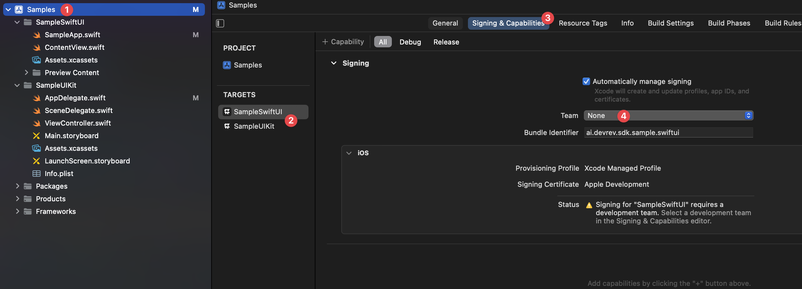

# Quickstart guide

The DevRev SDK can be integrated using either Swift Package Manager (SPM) or CocoaPods.

<Callout intent="note">
We recommend integrating the DevRev SDK using SPM.
</Callout>

## Swift Package Manager

To integrate the DevRev SDK into your project using SPM:

1. Open your project in Xcode and navigate to the **Add Package Dependency**.
2. Enter the DevRev SDK URL under **Enter Package URL**:
	- For HTTPS: https://github.com/devrev/devrev-sdk-ios
	- For SSH: `git@github.com:devrev/devrev-sdk-ios.git` 
3. In the **Build Phases** section of your app target, locate the **Link Binary With Libraries** phase and confirm that `DevRevSDK` is linked. If not, add it by clicking **+** and selecting `DevRevSDK` from the list.

Now you should be able to import and use the DevRev SDK in your project.

## CocoaPods

To integrate the DevRev SDK using CocoaPods:

1. Add the following to your Podfile:
	```ruby
	pod 'DevRevSDK', '~> 1.0.0'
	```
2. Run `pod install` in your project directory.

This will install the DevRev SDK in your project, making it ready for use.

## Set up the DevRev SDK

1. Open the DevRev web app at [https://app.devrev.ai](https://app.devrev.ai) and go to the **Settings** page.
2. Under **PLuG settings** copy the value under **Your unique App ID**.
3. After obtaining the credentials, you can configure the DevRev SDK in your app.

<Callout intent="note">
The DevRev SDK must be configured before you can use any of its features.
</Callout>

The SDK will be ready for use once you execute the following configuration method.
```swift
DevRev.configure(appID:)
```
For example:

```swift
DevRev.configure(appID: "abcdefg12345")
```

- UIKit apps

Configure the SDK in the `AppDelegate.application(_:didFinishLaunchingWithOptions:)` method.

- SwiftUI apps

Depending on your app's architecture, configure the SDK at the app's entry point or initial view.

## Sample app
A sample app with use cases for both UIKit and SwiftUI has been provided as part of our [public repository](https://github.com/devrev/devrev-sdk-ios).

Before you start using the sample app you will need to configure it to be used with your Apple Developer team and your DevRev credentials. For your convenience the code has been marked with compiler error directives (`#error`) at the places that need attention.

1. Add your credentials to the relevant `AppDelegate.swift` of the SwiftUI or UIKit sample.
   - After you have added the credentials, delete or comment out the compiler error lines in the respective files.
1. Configure the code signing for the sample target:
	- Open the project settings (1),
	- Select the appropriate target (2),
	- Go to the Signing & Capabilities section (3), and
	- Select your development team under Team (4).
	
