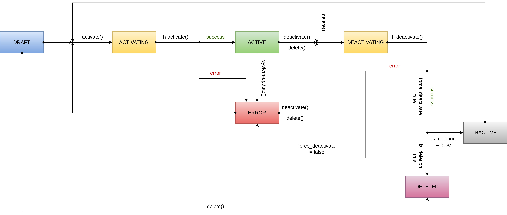

## Snap-in platform

A snap-in platform manages snap-in packages and installs snap-ins. It enables snap-ins to register, validate, and deploy functions, creating other DevRev objects, registering events/webhooks, and triggering actions enriched by context.

## Snap-in

Snap-ins are collections of objects that extend DevRev's core platform value. These objects include automation, event sources, keyrings, custom types, and vistas. With snap-ins, developers can develop at "arms-length" and without making any changes to DevRev's core platform.

Snap-in developers interact with DevRev objects through APIs, get updates on DevRev objects through webhooks, and register an event source to subscribe to GitHub/Slack/any external events.

## Snap-in package

A snap-in package is a collection of DevRev objects and their relationships that describe the functionality of the developed snap-in. 
It doesn't reference an object within the installer's dev org. It's a parent object collecting snap-in versions. A good analogy for a snap-in package is an Andriod/iOS app which can house different versions of the code.

## Snap-in version

A snap-in version is the definition of a snap-in. It doesn't belong to any dev org. It's equivalent to a snap-in source code. When a snap-in version is installed, it requires certain inputs from the installer, such as a PAT for GitHub, registering a URL on Bitbucket, or some configuration.

The snap-in developer can specify input configurations that the installer can use to customize the installed snap-in.

## Automation

In automation, the event source is linked to a function, so whenever an event occurs on that event source, the function is triggered and the event payload is passed along. All keyrings configured by the installer are included in the payload passed to the functions, along with developer-level tokens.

## Connection

A connection uses a keyring object to provide authentication, access token refreshment, and secret storage (access token, refresh token, PAT, API key, and more). Upon creating the connection, the platform automatically refreshes the OAuth access token whenever necessary. Objects can reference secrets to access external or DevRev-protected APIs. The platform may use a connection to automatically register the webhook URL with an external source. Automations may also use connections to pass secret values to corresponding functions.

## Event source

[Event sources](/snapin-development/references/event-sources) collect events from webhooks, emails, and timer-based API calls. Events can also be manually published. DevRev supports the ingestion of webhooks from any source. Each event source is assigned to a dev org.

For example, if you want to collect webhook events from an organization's GitHub, create an event source that gives you a URL to subscribe to on GitHub. Webhook events published to this URL are available from this event source.

## Function

The framework for executing code provided by users is [functions](/snapin-development/references/functions). Currently, Javascript/TypeScript can be taken as input from the user and deployed as a function.

Connection values can be passed to a function at runtime, enabling it to execute API calls to DevRev and external systems such as GitHub, Slack, Bitbucket, and Discord.

## Inputs

Snap-ins can be configured to enable and disable features, based on custom inputs defined by the developer and provided by the installer.

## Commands

A user can trigger [commands](/snapin-development/references/commands) on different surfaces based on some parameters. Once a command is executed, a function is triggered.

A developer can develop commands to be included in a snap-in version along with associated functions. These commands are installed when the snap-in is installed.

As part of the snap-in, commands have access to keyrings, global variables, and event sources.

## Hooks

[Hooks](/snapin-development/references/hooks) enable developers to invoke functions when various events in the lifecycle of a snap-in occur. Hooks can be used to perform various actions based on the event such as validating the snap-in inputs and keyrings when the configuration is updated, registering event sources and webhooks in external platforms when snap-in is activated, or setting custom fields to be used by the snap-in.

Detailed documentation on hooks can be found in the [hooks reference](/snapin-development/references/hooks).

## States

The snap-in can have the following states:

- _DRAFT_: The snap-in installation is in progress and the event sources, automations, and commands aren't created yet.
- _ACTIVATING_: The snap-in is being activated, and the automations, commands, and snap-kit actions are paused. The snap-in can't be updated in this state.
- _ACTIVE_: The snap-in is functioning, and the automations, commands, and snap-kit actions can be invoked.
- _ERROR_: The snap-in isn't functioning, and the automations, commands, and snap-kit actions are paused. This state can be reached in case of any misconfiguration of the snap-in (such as invalid keyrings or inputs) or failure to activate the snap-in.
- _DEACTIVATING_: The snap-in is being deactivated, and the automations, commands, and snap-kit actions are paused. The snap-in can't be updated in this state.
- _INACTIVE_: The snap-in is paused by the user, and the automations, commands, and snap-kit actions are paused.

<Callout intent="info">
_ACTIVATING_ and _DEACTIVATING_ are transitory states and background processes and hooks move the snap-in from these states to a stable state.
</Callout>

The following diagram illustrates the transitions between different states.

## Snap-in resources

Snap-in resources are user-level objects like keyrings, event sources, and inputs. These are set after an user updates their personal configuration for a snap-in and toggles `Enable for me`. Snap-ins can get resources for a user using the DevRev Beta [API](https://docs.devrev.ai/beta-api-spec#/operations/snap-ins-resources) `snap-ins.resources`.

## Snap-kit

[Snap-kit](/snapin-development/references/snapkit) defines UI customization components. It's defined in the snap-in package and used to display developer-defined components. A snap-kit component can display data to a user or collect input for triggering a function.

## Marketplace

The [marketplace](https://marketplace.devrev.ai/marketplace) is a portal where DevRev and external developers can publish snap-ins and other extensions.

If developers want to make their snap-ins available only to their dev org, and optionally to some external ones, they can publish them to the marketplace with `restricted` access.

## Personas

### Publisher

The developer's dev org is responsible for publishing the snap-in to the marketplace. The publisher is responsible for supporting snap-in users.

### Installer

Installers install the snap-in, provide configuration inputs, set up the necessary keyrings, and configure webhooks for external apps.
