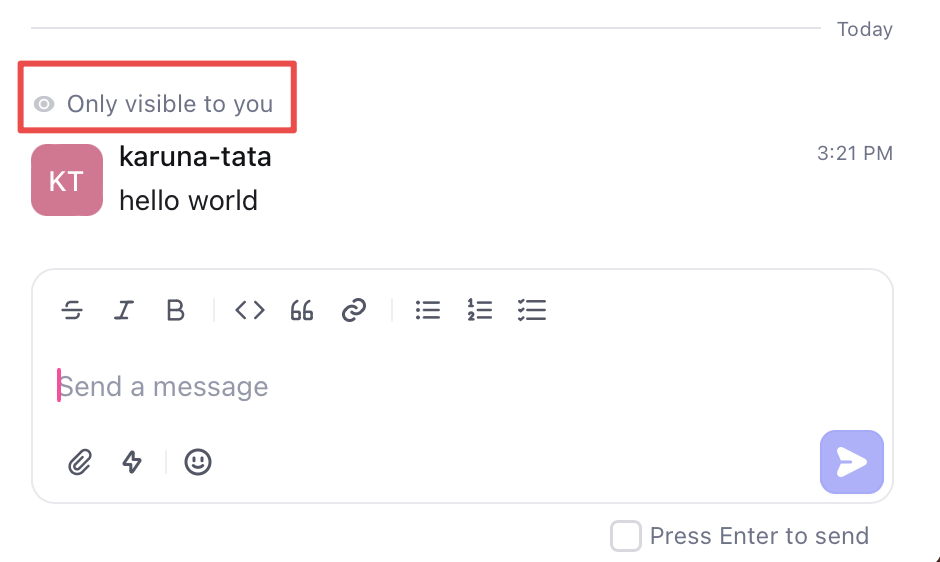

## Introduction

In this tutorial, you'll learn how to send restricted visibility messages on the timeline of an object by using the `timeline-entries-create` API. These messages are only visible to the specific users you give access to.

The [timeline entries](/api-reference/timeline-entries/create) API is used to create discussions (comments) on the timeline of an object such as a ticket or issue. These messages can be sent by users or by a bot.
You can use this to send any information about a customer like their last logged in date and time, the last page they visited, or an error they encountered.

### Send a restricted visibility message

To send a restricted visibility message, follow the steps listed below:

The payload to make a request would look like given below: 

<CodeBlock title="Payload">
```json {4-6}
    {
        "object": "don:core:<partition>:devo/<dev-org-id>:<object-type>/<object-id>",
        "body": "<private message to post on timeline>",
        "visibility": "private",
        "private_to": [<list of user IDs>],
        "type": "timeline_comment"
    }
``` 
</CodeBlock>

* `object` must be of type string and contains `<partition>`, `<dev-org-id>`, and `<object-id>`.
* `body` is of type string and contains the actual message to be posted.
* `visibility` is set to `private` in order for the message to be visible only to users, `internal` is visible with the Dev organization, `external` is visible to the Dev organzation and customers, and `public` is visible to all. 
* `type` should be `timeline_comment`.

1. Get the [object ID](/api-reference/getting-started) and object type where you want to send a message.

> Example: In issue `ISS-69`, `69` is the object ID and `ISS` indicates the object type `issue`.

2. Get the `dev-org-id` and `partition` by making a call to the [`dev-users.self` API](/api-reference/getting-started#send-your-first-api-request).

3. Get the display IDs of the users you want to send the private message to. Add these display IDs in the `private_to` array.

> Example: `DEVU-1`

4. Make a POST request to ("https://api.devrev.ai/timeline-entries.create") and include the PAT created in the authorization header of the request along with the payload with replaced IDs.

In this example, you are using curl to make the requests but you can use any tool you prefer.

<CodeBlock title="Request">
```bash
curl -X POST -H "Content-Type: application/json" -d 
'{
    "object": "don:core:<partition>:devo/<dev-org-id>:<object-type>/<object-id>",
    "body": "message",
    "visibility": "private",
    "type": "timeline_comment"
}' 
'https://api.devrev.ai/timeline-entries.create' \
--header 'Authorization: <PAT>'
```
</CodeBlock>

You receive the following `json` response.

```json {19}
{
    "timeline_entry": {
        "type": "timeline_comment",
        "body": "message",
        "body_type": "text",
        "created_by": {
            "type": "dev_user",
            "display_id": "DEVU-1",
            "display_name": "John Doe",
            "email": "karuna.tata@devrev.ai",
            "full_name": "John Doe",
            "id": "don:identity:dvrv-us-1:devo/<dev-org-id>:devu/1",
            "state": "active"
        },
        "created_date": "2023-11-29T09:05:47.497205Z",
        "id": "don:core:dvrv-us-1:devo/<dev-org-id>:conversation/172:comment/xqsvvdwvt6hjw",
        "object": "don:core:dvrv-us-1:devo/<dev-org-id>:conversation/172",
        "object_type": "conversation",
        "visibility": "private"
    }
}
```

You can check the object to which you sent a message in the UI. It's visible to the creator and the users you added in `private_to`.


## Summary

In this tutorial, you learned how to post a comment on the timeline of an issue/ticket using the `timeline-entries.create` API with different visibilities. You can now use this to create comments on timeline using automation or manually based on your use case.