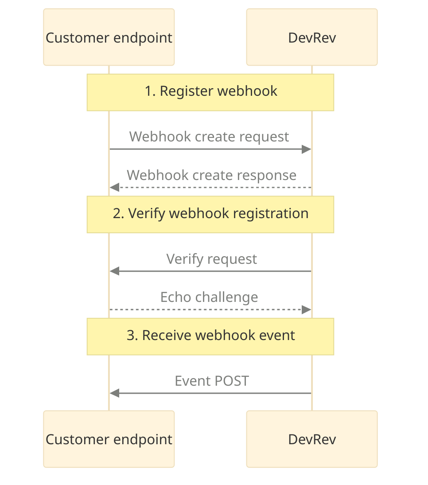

Webhooks allow you to build custom workflows in response to events on the DevRev platform.
A webhook can be thought of as a 'reverse API' that's driven by events rather than requests. While APIs are used to pull data from the system, webhooks are a mechanism for the system to push data to a pre-configured endpoint.
Webhooks allow you to receive notifications based on events without having to explicitly make a request.

## Webhook workflow

You must first set up an HTTP server that listens on a publicly accessible endpoint.
When ready, you must register the endpoint’s URL with DevRev by creating a webhook object that is
associated with your Dev org. After successful registration and verification of the endpoint,
DevRev issues HTTP requests (that is, invoke the endpoint) for all events that match the event types
that the webhook is registered for. Your HTTP server receives an event’s information,
verify it using the event’s provided metadata, and return a response indicating successful reception.
The types of events that can be received through webhooks are object mutation events (create, update, delete).
Events are delivered concurrently in a semi-ordered (but not guaranteed) manner,
where object timestamps and versions enable you to determine the order of events for a particular object.



## Webhook event handling

All events are delivered to the same registered endpoint, and there is a single request schema to encompass all events that contains the following fields:

- `webhook_id`: Identifies the webhook that the event is being delivered for.
- `timestamp`: The timestamp for the event.
- `type`: The event type. This is always followed by a field of the type’s name that contains the event’s data.

### Event POST `[json]`

Event POST from DevRev to your endpoint

```json
POST your-webhook-endpoint-url
X-DevRev-Signature: z1BY0e8JYzEGfxZ8e4k8agCdWQyTr2An

{
	"id": "don:integration:dvrv-us-1:devo/1H79gci4u/webhook/123:event/abcdef",
	"webhook_id": "don:integration:dvrv-us-1:devo/1H79gci4u/webhook/123",
	"timestamp": "2022-08-01T12:00:00.123456789Z",
	"type": "work_created",
	"work_created": {...}
}
```

Supported events include the standard create/update/delete operations. When providing objects in webhook payloads, the schema for the objects is the same as those from the OpenAPI specification, which enables interoperability between REST and Webhook events APIs.
Multiple events may be invoked concurrently for the same webhook endpoint.

<Callout intent="note">
It's strongly recommended that the webhook endpoint respond immediately to webhook invocations such that any non-trivial processing is done asynchronously. If a response isn’t returned within 3 seconds, the invocation will be aborted and retried at a later time.
</Callout>

## Steps to set up and receive webhooks

Let us use an example to walk through how webhooks can be set up.
You are building a work distribution system, and would like to be notified anytime a new work item
is created or deleted on DevRev.

You can start receiving event notifications using the following steps:

1. Set up a secure HTTP server and expose a publicly accessible endpoint, which serves as the webhook invocation target.
   Insert your endpoint where the following is mentioned: `your-webhook-endpoint-url`.

2. Identify the events you want to monitor and the event payloads to parse.
   Look up the supported events and event payloads in our API Methods section.
   A general guideline here is to only subscribe to event types which you require in order
   to avoid overwhelming your HTTP server.
   In the above example, you may be interested in `work_created` and `work_deleted`.

3. Register webhook endpoint

   Before webhook events can be processed, you must inform DevRev of the URL where the events should be
   delivered, along with the specific event types that you are interested in.
   As a result of this registration, DevRev passes back a secret that is used to
   verify requests. This secret is never provided when invoking a webhook, only when you call into DevRev
   (using TLS), however the webhook request contains a derivative of the secret that you will use to verify
   DevRev as the originator.

     [API Reference: Create Webhook](/api-reference/webhooks/create)

   You will invoke DevRev webhook create with the following fields for our example:

### Webhook create request `[bash]`

```bash
curl  --request POST 'https://api.devrev.ai/webhooks.create' --header "Authorization:token"
      --header 'Content-Type: application/json' --data-raw
      '{
         "event_types": ["work_created", "work_deleted"],
         "url": "your-webhook-endpoint-url"
      }'

```

The following response is sent by DevRev

### Webhook create response `[json]`

```json
201 Created

{
   "webhook": {
	   "id": "don:integration:dvrv-us-1:devo/123:webhook/234",
 	   "event_types": ["work_created", "work_deleted"],
 	   "url": "your-webhook-endpoint-url"
 	   "secret": secret-string,
 	   "status": "unverified"
   }
}
```

After creation, DevRev sends a verify request to verify the endpoint is reachable and was intentionally
created by the owner (that is, not a malicious client using a URL that they don’t own).
To perform a successful verification, your endpoint must echo the provided challenge within 3 mins of the Create Request:

### Verify request `[json]`

```json
POST your-webhook-endpoint-url
X-DevRev-Signature: GfxZ8e4k8agCdWQyTr2z1BY0e8JYzEAn
{
   "id": "don:integration:dvrv-us-1:devo/1H79gci4u:webhook/123:event/abcdef",
   "webhook_id": "don:integration:dvrv-us-1:devo/1H79gci4u:webhook/123",
   "timestamp": "2022-08-01T12:00:00.123456789Z",
   "type": "verify",
   "verify": {
 		"challenge": "DlrVaK7zRyZWwbJhj5dZHDlrVaK7Jhj5dZZjH"
   }
}
```

The following response is expected from your endpoint

### Echo challenge `[json]`

```json
200 OK

{
"challenge": "DlrVaK7zRyZWwbJhj5dZHDlrVaK7Jhj5dZZjH"
}
```

You are all set.
Once verified, the status of the webhook is updated to be active and DevRev begins to deliver
the subscribed events to the webhook endpoint.
The APIs for standard CRUDL behavior for webhooks are found in the API methods section.

## Webhook failure handling

To mitigate intermittent and/or transient failures, DevRev retries unacknowledged webhooks invocations. By default, three attempts are made: the first immediately, the second after a 30-second delay, and the third after a three-minute delay. If sustained failures are encountered, the webhook service marks the webhook endpoint to be in a degraded state and it’ll fail any queued events without invocation attempts. When in this state, verify requests are restarted to determine when the endpoint becomes healthy again and eventually promoted back to the active state.

## Webhook security

A header signature `X-DevRev-Signature` is always provided, which is a hash-based message authentication code (HMAC) utilizing SHA256 consisting of the secret as the key and the raw request payload as the message. Any adversary that intercepts and modifies the request is unable to reproduce the proper signature, and therefore should be discarded by the webhook endpoint. Note that this method is still subject to replay attacks, such that an adversary could intercept the request and replay it at different points in time, however the timestamp should be used to validate the proximity of the request and be discarded if stale.

<Callout intent="note">
The webhook endpoint must handle duplicate deliveries of the same event.
</Callout>